# Microservices patterns
- [Паттерны декомпозиции на микросервисы](#паттерны-декомпозиции-на-микросервисы)
    1. [Шаблон «Разбиение по бизнес-возможностям» (Decompose By Business Capability)](#1-шаблон-разбиение-по-бизнес-возможностям-decompose-by-business-capability)
    2. [Шаблон «Разбиение по поддоменам» (Decompose By Subdomain)](#2-шаблон-разбиение-по-поддоменам-decompose-by-subdomain)
- [Паттерны рефакторинга для перехода на микросервисы](#паттерны-рефакторинга-для-перехода-на-микросервисы)
    1. [Шаблон «Душитель» (Strangler)](#1-шаблон-душитель-strangler)
    2. [Шаблон «Уровень защиты от повреждений» (Anti-Corruption Layer)](#2-шаблон-уровень-защиты-от-повреждений-anti-corruption-layer)
- [Паттерны управления данными в микросервисной архитектуре](#паттерны-управления-данными-в-микросервисной-архитектуре)
    1. [Шаблон «База данных на сервис» (Database Per Service)](#1-шаблон-база-данных-на-сервис-database-per-service)
    2. [Шаблон «API-композиция» (API Composition)](#2-шаблон-api-композиция-api-composition)
    3. [Шаблон «Разделение команд и запросов» (Command Query Responsibility Segregation, CQRS)](#3-шаблон-разделение-команд-и-запросов-command-query-responsibility-segregation-cqrs)
    4. [Шаблон «Поиск событий» (Event Sourcing)](#4-шаблон-поиск-событий-event-sourcing)
    5. [Шаблон «Сага» (Saga)](#5-шаблон-сага-saga)
- [Паттерны коммуникации микросервисов](#паттерны-коммуникации-микросервисов)
    1. [Шаблон «API-шлюз» (API Gateway)](#1-шаблон-api-шлюз-api-gateway)
    2. [Шаблон «Бэкенды для фронтендов» (Backends for Frontends, BFF)](#2-шаблон-бэкенды-для-фронтендов-backends-for-frontends-bff)
- [Паттерны построения пользовательского интерфейса](#паттерны-построения-пользовательского-интерфейса)
    1. [Шаблон «Сборка пользовательского интерфейса на стороне клиента» (Client-Side UI Composition)](#1-шаблон-сборка-пользовательского-интерфейса-на-стороне-клиента-client-side-ui-composition)
    2. [Шаблон «Сборка фрагментов страниц на стороне сервера» (Server-Side Page Fragment Composition)](#2-шаблон-сборка-фрагментов-страниц-на-стороне-сервера-server-side-page-fragment-composition)
- [Паттерны обнаружения сервисов в микросервисной архитектуре](#паттерны-обнаружения-сервисов-в-микросервисной-архитектуре)
    1. [Шаблон «Обнаружение сервисов на стороне клиента» (Client-Side Service Discovery)](#1-шаблон-обнаружение-сервисов-на-стороне-клиента-client-side-service-discovery)
    2. [Шаблон «Обнаружение сервисов на стороне сервера» (Server-Side Service Discovery)](#2-шаблон-обнаружение-сервисов-на-стороне-сервера-server-side-service-discovery)

Источник: [26 основных паттернов микросервисной разработки](https://cloud.vk.com/blog/26-osnovnyh-patternov-mikroservisnoj-razrabotki)

## Паттерны декомпозиции на микросервисы
Этот блок шаблонов предлагает решения для декомпозиции, то есть разделения приложений на микросервисы.

### 1. Шаблон «Разбиение по бизнес-возможностям» (Decompose By Business Capability)
Определение бизнес-возможностей приложения и создание по одному микросервису на каждую из них. Бизнес-возможности представляют собой функции, которые будут доступны пользователям при работе с приложением.
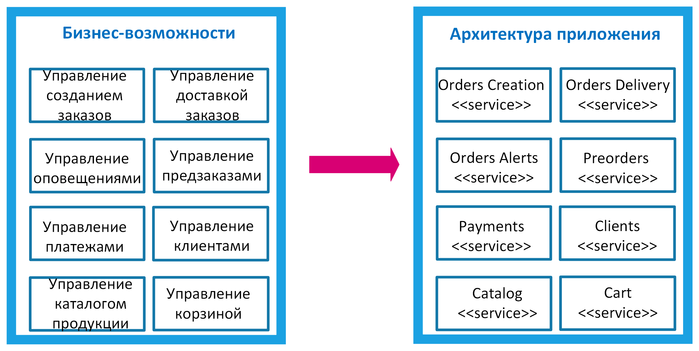

### 2. Шаблон «Разбиение по поддоменам» (Decompose By Subdomain)
При разбиении по бизнес-возможностям могут появиться так называемые «божественные классы» (God Classes) — сущности, которые будут общими для нескольких микросервисов. Как правило, их очень сложно разделить.

Например, в приложении для интернет-магазина такой сущностью может стать заказ. В приведенном выше примере он используется сразу в нескольких сервисах: создание заказов (Orders Creation), доставка заказов (Orders Delivery), оповещения о заказах (Orders Alerts), предзаказы (Preorders).

Чтобы избежать появления God Classes, можно использовать альтернативный шаблон разложения на микросервисы — разбиение по поддоменам. Он основан на концепциях предметно-ориентированного проектирования (Domain-Driven Design, DDD).

DDD разбивает всю модель предметной области (домен) на поддомены. У каждого поддомена своя модель данных, область действия которой принято называть ограниченным контекстом (Bounded Context). Каждый микросервис будет разрабатываться внутри этого ограниченного контекста. Основная задача при использовании DDD-подхода — подобрать поддомены и границы между ними так, чтобы они были максимально независимы друг от друга.

Если вернуться к примеру с интернет-магазином, то все, что связано с заказами, можно рассматривать в рамках поддомена «Заказы» (Orders Subdomain) и именно внутри этого поддомена создавать микросервис по управлению заказами (Orders Service). Таким образом, можно сократить число микросервисов по сравнению с декомпозицией на основе бизнес-возможностей. В нашем сильно упрощенном примере четыре микросервиса были преобразованы в один.

Пример создания микросервисов на основе поддоменов для интернет-магазина: по сравнению с декомпозицией на основе бизнес-возможностей число микросервисов, так или иначе связанных с заказами, сокращено с 4 до 1

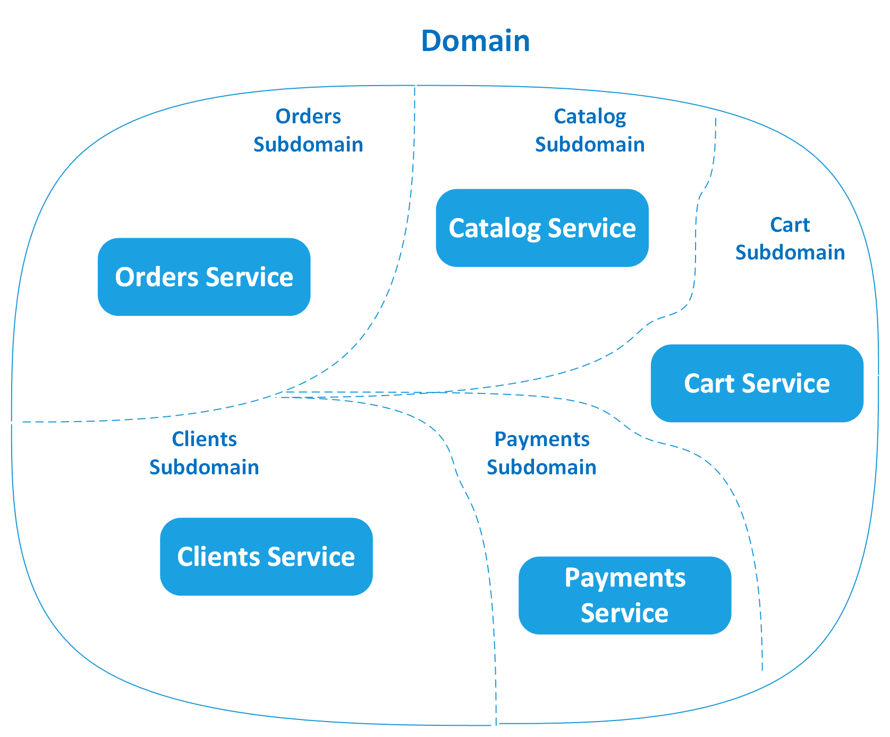

## Паттерны рефакторинга для перехода на микросервисы
Эта группа шаблонов предназначена для организации взаимодействия с Legacy-приложениями и/или их постепенного перевода на микросервисную архитектуру.

### 1. Шаблон «Душитель» (Strangler)
Рассмотренные выше способы разбиения на микросервисы хорошо подходят для новых приложений, создаваемых с нуля. Однако на практике часто возникает необходимость перевести на микросервисную архитектуру уже существующие монолитные приложения. Разложение монолита на микросервисы требует времени и не может быть выполнено за одну итерацию. Поэтому и был разработан паттерн Strangler, названный по аналогии с лианой, которая постепенно душит обвиваемое ею дерево.

Этот шаблон означает миграцию монолитного приложения на микросервисную архитектуру путем постепенного переноса существующих функций в микросервисы. Настраивается маршрутизация запросов между устаревшим монолитом и микросервисами. Когда очередная функциональность переносится из монолита в микросервисы, фасад перехватывает клиентский запрос и направляет его к микросервисам. Новые функции при этом реализуются исключительно в микросервисах, минуя монолит. После переноса всех функций монолитное приложение полностью выводится из эксплуатации.

Паттерн не рекомендуется использовать при небольших размерах монолита. В таком случае лучшим решением будет его единовременный перевод на микросервисную архитектуру, так как добавление фасада увеличивает задержки и затрудняет тестирование.

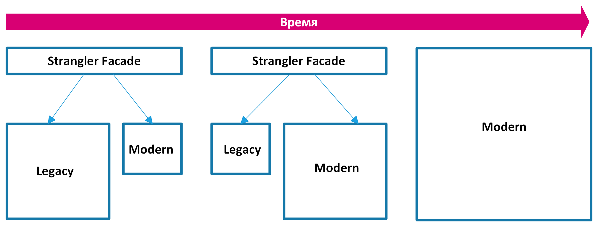

### 2. Шаблон «Уровень защиты от повреждений» (Anti-Corruption Layer)
При переводе Legacy-приложений на микросервисы рефакторинг некоторых подсистем может оказаться очень долгим либо вовсе невозможным. Но взаимодействовать с устаревшими подсистемами все равно нужно, несмотря на то, что в них, возможно, используются не самые современные технологии в части построения API, схем данных и так далее.

Для таких случаев отлично подходит паттерн Anti-Corruption Layer. Он предназначен для изолирования различных подсистем путем размещения между ними дополнительного уровня, который может быть реализован как компонент приложения или независимая служба. Этот уровень связывает две подсистемы, позволяя им оставаться максимально независимыми друг от друга. Он содержит всю логику, необходимую для передачи данных в обе стороны: при взаимодействии с каждой из подсистем используется именно ее модель данных.

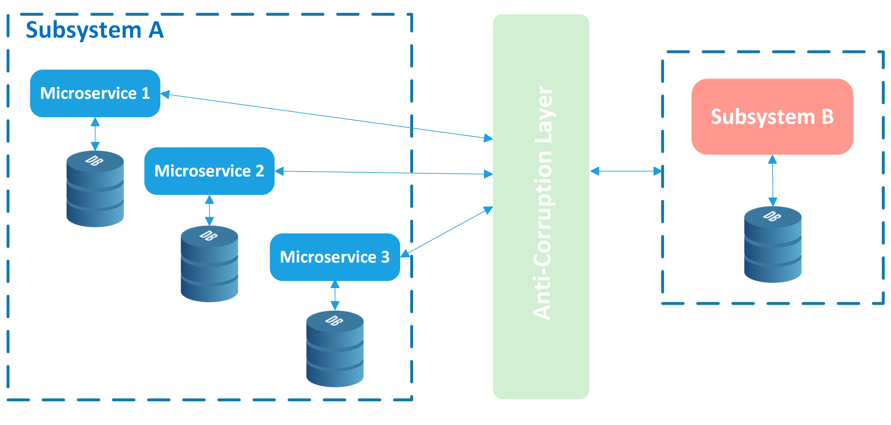

## Паттерны управления данными в микросервисной архитектуре
Этот блок шаблонов описывает возможные варианты взаимодействия микросервисов с базами данных.

### 1. Шаблон «База данных на сервис» (Database Per Service)
Основная рекомендация при переходе на микросервисы — предоставить каждому сервису собственное хранилище данных, чтобы не было сильных зависимостей на уровне данных. При этом имеется в виду именно логическое разделение данных, то есть микросервисы могут совместно использовать одну и ту же физическую базу данных, но в ней они должны взаимодействовать с отдельной схемой, коллекцией или таблицей.

Основанный на этих принципах паттерн Database Per Service повышает автономность микросервисов и уменьшает связь между командами, разрабатывающими отдельные сервисы.

У паттерна есть и недостатки: 
- усложняется обмен данными между сервисами и предоставление транзакционных гарантий ACID. 
- Паттерн не стоит применять в небольших приложениях — он предназначен для крупномасштабных проектов с большим числом микросервисов, где каждой команде требуется полное владение ресурсами для повышения скорости разработки и лучшего масштабирования.

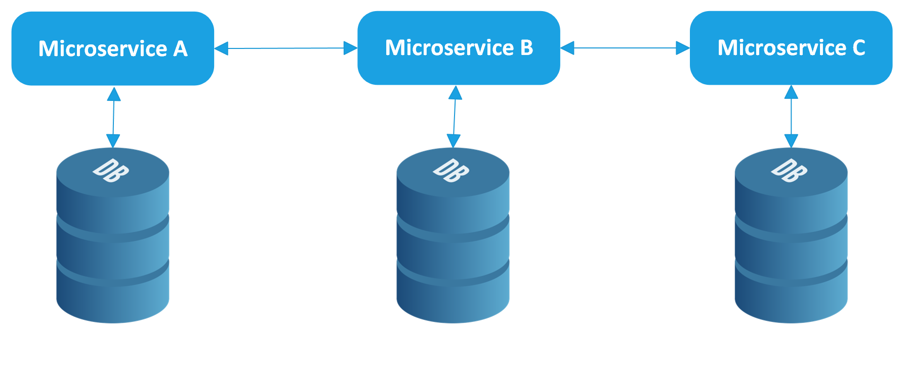

Паттерну __Database Per Service__ часто противопоставляют другой шаблон — __Shared Database («Разделяемая база данных»)__. По сути, он представляет собой антипаттерн и подразумевает использование одного хранилища данных несколькими микросервисами. Его допускается использовать на начальных стадиях миграции на микросервисную архитектуру или в очень небольших приложениях, разрабатываемых одной командой (2–3 микросервиса).

### 2. Шаблон «API-композиция» (API Composition)
Этот шаблон является одним из возможных вариантов получения данных из нескольких сервисов после применения к ним паттерна Database Per Service. Он предлагает создать отдельное API, которое будет вызывать необходимые сервисы, владеющие данными, и выполнять соединение полученных от них результатов в памяти. Паттерн можно рассматривать как вариант использования другого шаблона — API Gateway, о котором мы поговорим ниже.

API Composition — это самый простой способ получения данных из нескольких источников, но он может привести к неэффективному объединению больших наборов данных в памяти. Альтернативным решением является следующий шаблон CQRS.
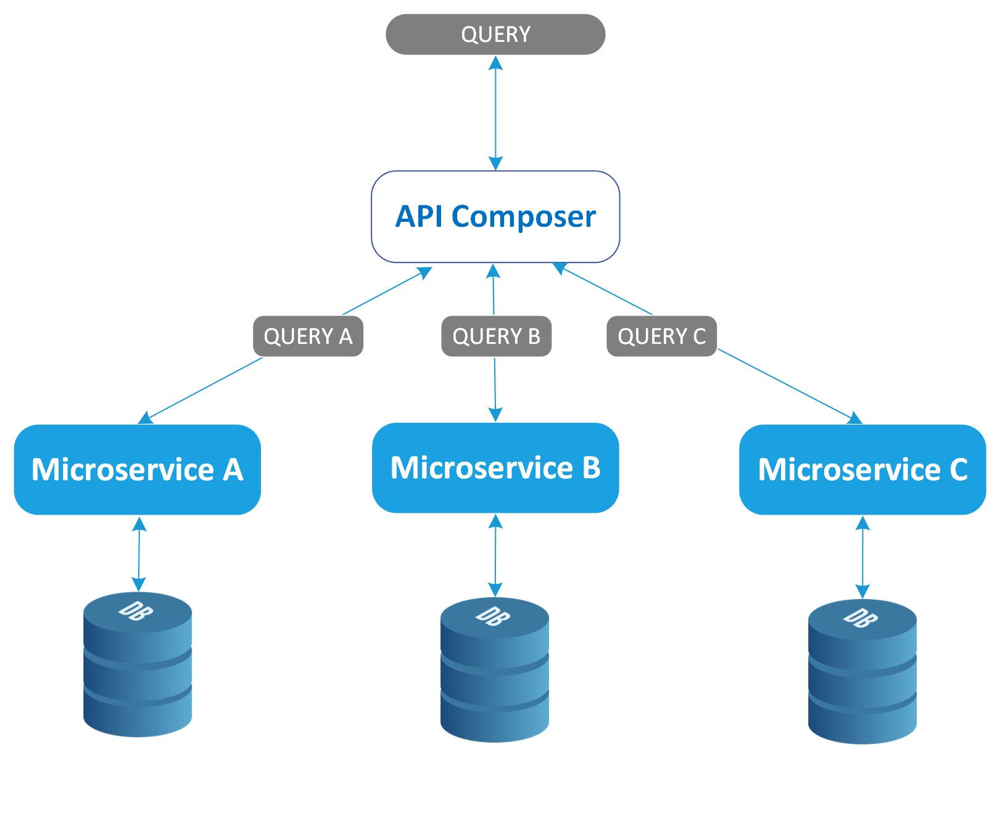

### 3. Шаблон «Разделение команд и запросов» (Command Query Responsibility Segregation, CQRS)
Этот паттерн предлагает отделить изменение данных (Command) от чтения данных (Query). Шаблон CQRS имеет две формы: простую и расширенную.

В простой форме для чтения и записи используются отдельные модели ORM (Object-Relational Mapping), но общее хранилище данных.

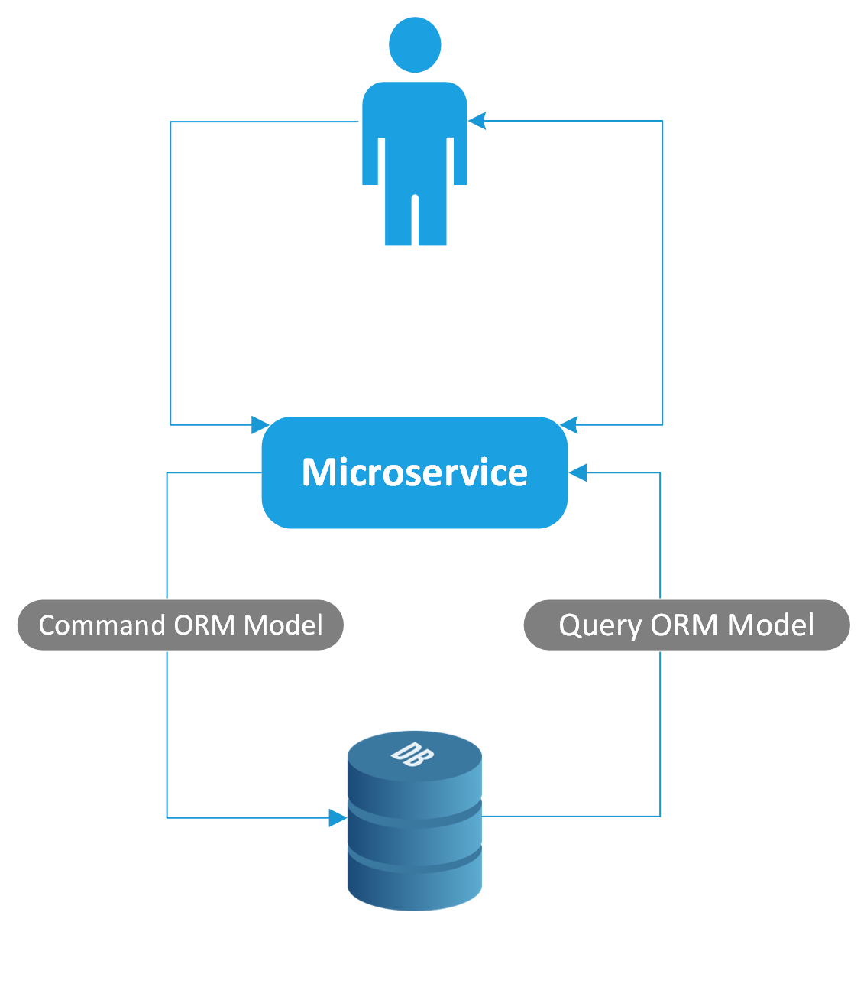

В расширенной форме используются разные хранилища данных, оптимизированные для записи и чтения данных. Данные копируются из хранилища для записи в хранилище для чтения асинхронно. В результате хранилище для чтения отстает от хранилища для записи, но в конечном итоге является согласованным. Расширенный CQRS часто используется совместно с паттерном Event Sourcing, речь о котором идет далее.

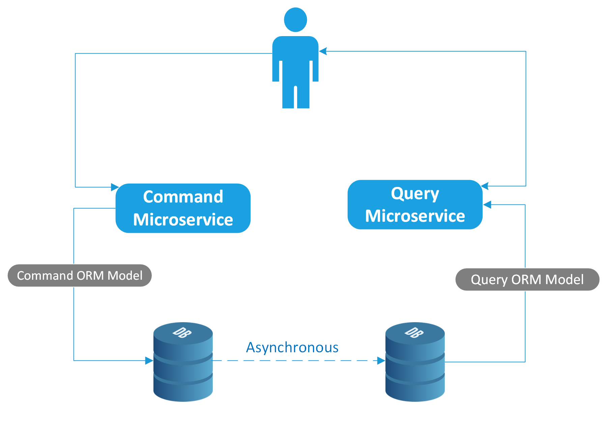

Паттерн CQRS обеспечивает высокую доступность данных, независимое масштабирование систем чтения/записи и более быстрое чтение данных в микросервисах, управляемых событиями. Однако его использование увеличивает сложность системы и приводит к слабой согласованности данных. Паттерн подходит для сложных систем, где для чтения данных требуется запрос в несколько хранилищ или операции чтения и записи имеют разную нагрузку.

### 4. Шаблон «Поиск событий» (Event Sourcing)
Приложения с микросервисной архитектурой часто используют асинхронные методы связи: сообщения или события. Для обеспечения атомарности операций в таких системах рекомендуется применять шаблон Event Sourcing.

В традиционных базах данных объект с текущим состоянием сохраняется напрямую. При использовании шаблона Event Sourcing вместо объектов сохраняются события, изменяющие их состояния. Итоговое состояние объекта можно получить путем повторной обработки серии событий, пришедших за определенное время. Различные службы могут воспроизводить события из хранилища событий, чтобы вычислить соответствующее состояние своих хранилищ данных. Для реализации хранилища событий обычно применяется шаблон CQRS.

Паттерн рекомендуется использовать в высокомасштабируемых транзакционных системах, управляемых событиями. Он не подходит для простых приложений, где микросервисы могут синхронно обмениваться данными (например, через API).

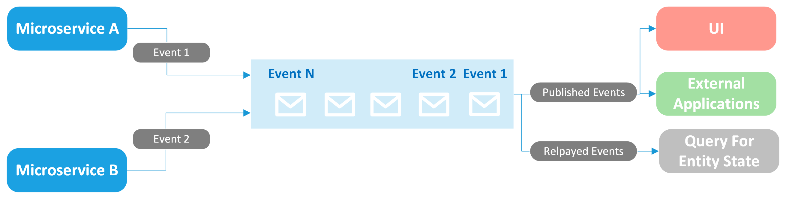

### 5. Шаблон «Сага» (Saga)
Этот паттерн предназначен для управления распределенными транзакциями в микросервисной архитектуре, где применение традиционного протокола двухфазной фиксации транзакций (Two-phase commit protocol, 2PC) становится трудноосуществимым.

При использовании паттерна каждая локальная транзакция обновляет данные в хранилище в рамках одного микросервиса и публикует событие или сообщение, которые, в свою очередь, запускают следующую локальную транзакцию и так далее. Если локальная транзакция завершается с ошибкой, выполняется серия компенсирующих транзакций, которые отменяют изменения предыдущих транзакций.

Для координации транзакций существует два основных способа:

- __Хореография__. Децентрализованная координация, при которой каждый микросервис прослушивает события/сообщения другого микросервиса и решает, следует предпринять действие или нет.
- __Оркестровка__. Централизованная координация, при которой отдельный компонент (оркестратор) сообщает микросервисам, какое действие необходимо выполнить далее.

Использование шаблона обеспечивает согласованность транзакций в слабосвязанных распределенных системах, однако увеличивает сложность отладки. Saga отлично подходит для систем, управляемых событиями и/или использующих базы данных NoSQL без поддержки 2PC, но не рекомендуется при использовании баз данных SQL и в системах с циклическими зависимостями между сервисами.

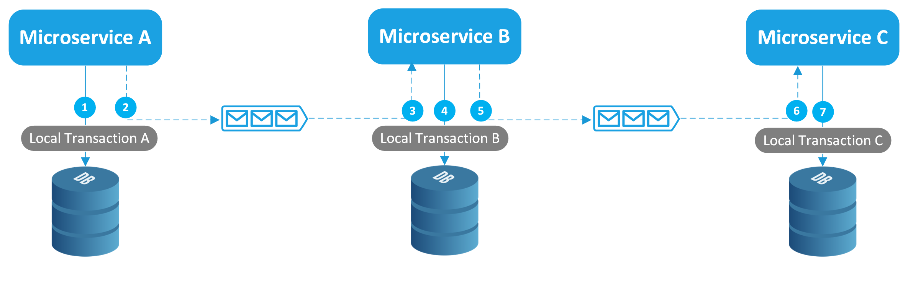

## Паттерны коммуникации микросервисов
Этот блок шаблонов охватывает способы внешних взаимодействий микросервисов: с клиентскими приложениями, удаленными сервисами и так далее.

### 1. Шаблон «API-шлюз» (API Gateway)
Наиболее очевидный способ обращения к микросервисам — прямое обращение от клиента к сервису. И его вполне можно применять в небольших проектах. Однако в приложениях корпоративного масштаба с большим числом микросервисов рекомендуется использовать шаблон API Gateway.

Этот паттерн основан на применении шлюза, который находится между клиентским приложением и микросервисами, обеспечивая единую точку входа для клиента.

В зависимости от конкретной цели использования паттерна иногда выделяют следующие его разновидности:

- __Gateway Routing__. Шлюз используется как обратный Proxy, перенаправляющий запросы клиента на соответствующий сервис.
- __Gateway Aggregation__. Шлюз используется для разветвления клиентского запроса на несколько микросервисов и возвращения агрегированных ответов клиенту.
- __Gateway Offloading__. Шлюз решает сквозные задачи, которые являются общими для сервисов: аутентификация, авторизация, SSL, ведение журналов и так далее.

Применение паттерна сокращает число вызовов, обеспечивает независимость клиента от протоколов, используемых в сервисах: REST, AMQP, gRPC и так далее, обеспечивает централизованное управление сквозной функциональностью. Однако шлюз может стать единой точкой отказа, требует тщательного мониторинга и при отсутствии масштабирования бывает узким местом системы.

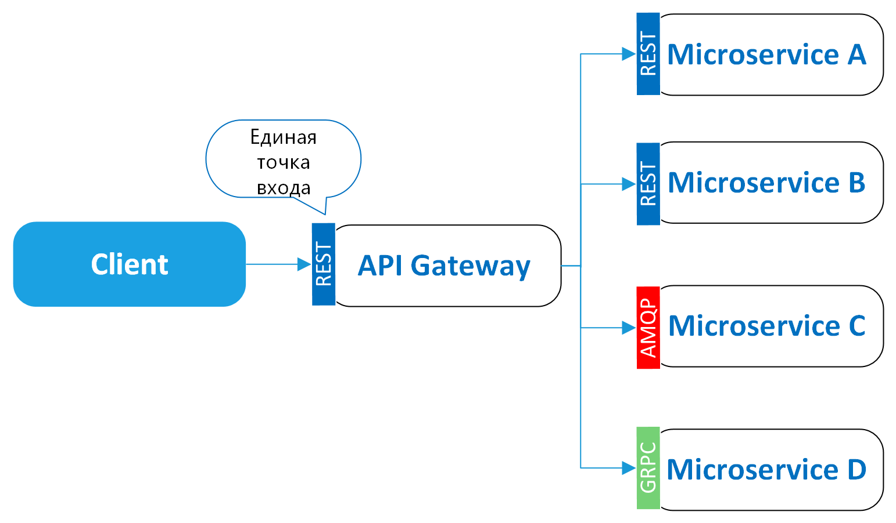

### 2. Шаблон «Бэкенды для фронтендов» (Backends for Frontends, BFF)
Этот паттерн является вариантом реализации шаблона API Gateway. Он также обеспечивает дополнительный уровень между микросервисами и клиентами, но вместо одной точки входа вводит несколько шлюзов для каждого типа клиента: Web, Mobile, Desktop и так далее.

С помощью паттерна можно добавить API, адаптированные к потребностям каждого клиента, избавившись от хранения большого количества ненужных настроек в одном месте. Но шаблон не стоит применять в тех случаях, когда разница в требованиях к API у разных типов клиентов незначительна либо приложение само по себе небольшое: это приведет лишь к дублированию кода и увеличению числа компонентов.

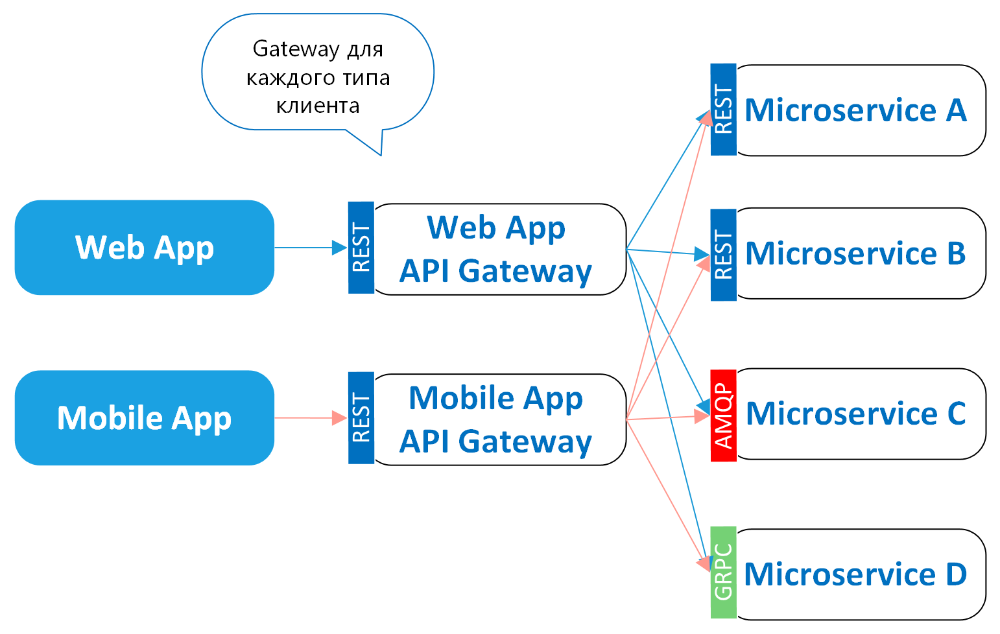

## Паттерны построения пользовательского интерфейса
Эта группа шаблонов предлагает решения для отображения на одной странице или экране пользовательского интерфейса данных из нескольких микросервисов.

### 1. Шаблон «Сборка пользовательского интерфейса на стороне клиента» (Client-Side UI Composition)
При использовании этого шаблона разметка HTML создается и обновляется непосредственно в браузере. Каждый экран/страница пользовательского интерфейса разбивается на фрагменты, данные для которых получают различные микросервисы. Каждый такой фрагмент, по сути, представляет собой мини-приложение, которое может отображать и обновлять свою разметку независимо от остальной части страницы.

Многие современные фреймворки, например AngularJS и ReactJS, помогают в реализации этого шаблона. Они используют принцип одностраничных приложений (Single-Page Application, SPA), позволяя обновлять отдельную область экрана, а не всю страницу целиком.

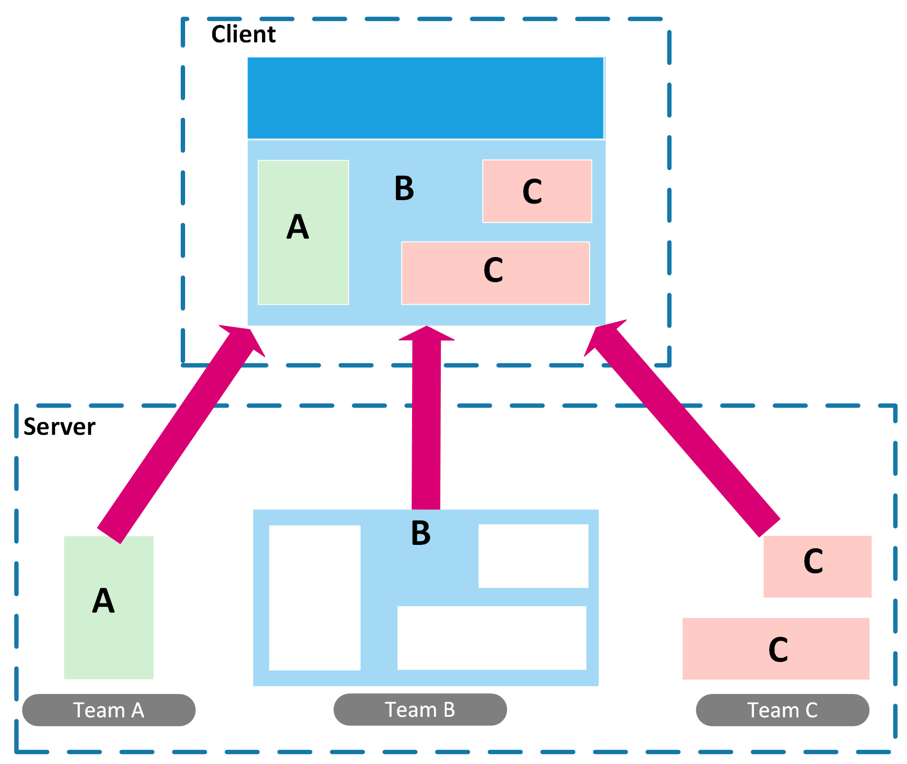

### 2. Шаблон «Сборка фрагментов страниц на стороне сервера» (Server-Side Page Fragment Composition)
При использовании этого шаблона сборка фрагментов пользовательского интерфейса происходит на сервере, а клиентская часть получает уже полностью собранную страницу, благодаря чему достигается более высокая скорость загрузки. Сборка обычно выполняется отдельной службой, которая находится между браузером и серверами приложений: Nginx, Varnish, CDN.

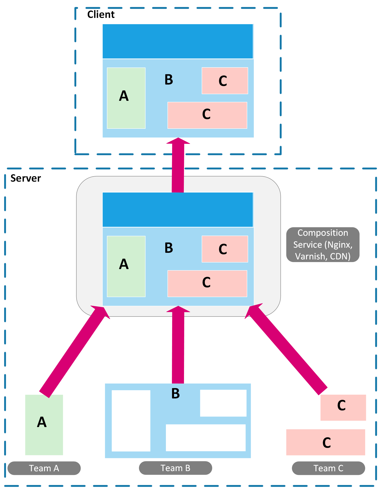

## Паттерны обнаружения сервисов в микросервисной архитектуре
Эта группа шаблонов описывает методы, которые могут использовать клиентские приложения для определения местонахождения нужных им сервисов. Это особенно важно в микросервисных приложениях, так как они работают в виртуализированных и контейнерных средах, где количество экземпляров сервисов и их расположение изменяются динамически.

Ключевым компонентом обнаружения микросервисов выступает реестр сервисов (Service Registry) — база данных с информа­цией о расположении сервисных экземпляров. Когда экземпляры запускаются и останавливаются, информация в реестре обновляется. Но взаимодействовать с реестром сервисов можно двумя путями, которые и легли в основу описанных ниже шаблонов.

### 1. Шаблон «Обнаружение сервисов на стороне клиента» (Client-Side Service Discovery)
Первый способ обнаружения сервисов — на стороне клиента. В этом случае сервисы и их клиенты напрямую взаимодействуют с реестром. 

Последовательность шагов следующая:
1. Экземпляр сервиса обращается к API реестра, чтобы зарегистри­ровать свое сетевое местоположение. Он также может предоставить URL-адрес для проверки своей работоспособности (Health Check), который будет использоваться для продления срока его регистрации в реестре.
2. Клиент самостоятельно обращается к реестру сервисов, чтобы получить список экземпляров сервисов. Для улучшения производительности клиент может кэшировать экземпляры сервиса.
3. Клиент использует алгоритм балансировки нагрузки, циклический или случайный, чтобы выбрать конкретный экземпляр сервиса и отправить ему запрос.

Ключевое преимущество обнаружения сервисов на стороне клиента — его независимость от используемой платформы развертывания. Например, если часть ваших сервисов развернута на K8s, а остальные работают в устаревшей среде, то обнаружение на уровне приложения будет лучшим вариантом, так как серверное решение на базе Kubernetes не будет совместимо со всеми сервисами.

К недостаткам подхода можно отнести необходимость использования различных клиентских библиотек для каждого языка программирования, а иногда и фреймворка. Кроме этого, на вашу команду ложится дополнительная нагрузка по настройке и обслуживанию реестра сервисов.

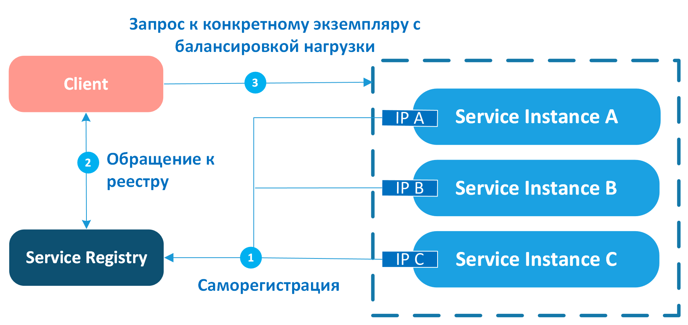

### 2. Шаблон «Обнаружение сервисов на стороне сервера» (Server-Side Service Discovery)
Второй способ обнаружения сервисов — на стороне сервера. В этом случае за регистрацию, обнаружение сервисов и маршрутизацию запросов отвечает инфраструктура развертывания. 

Последовательность шагов следующая:
1. Регистратор, который обычно является частью платформы развертывания, прописывает все экземпляры сервисов в реестре сервисов. По каждому экземпляру сохраняется DNS-имя и виртуальный IP-адрес (VIP).
2. Вместо того чтобы обращаться к реестру напрямую, клиент делает запрос по DNS-имени сервиса. Запрос поступает в маршрутизатор, являющийся частью платформы развертывания.
3. Маршрутизатор обращается к реестру сервисов для получения сетевого расположения экземпляров нужного сервиса.
4. Маршрутизатор применяет балансировку нагрузки, чтобы выбрать конкретный экземпляр сервиса и отправить ему запрос.

Все современные платформы развертывания, включая Docker, Kubernetes и другие, как правило, имеют встроенный реестр и механизмы обнаружения сервисов.

Основное преимущество паттерна состоит в том, что всеми аспектами обнаружения сервисов занимается сама платформа. Дополнительный код на стороне клиента или сервисов не требуется. Благодаря этому достигается независимость от используемых в приложении языков программирования и фреймворков.

Недостатком паттерна является невозможность его применения к сервисам, которые развернуты вне основной платформы, реализующей механизмы обнаружения. Несмо­тря на это ограничение, рекомендуется использовать обнаружение сервисов на стороне сервера всюду, где это осуществимо.

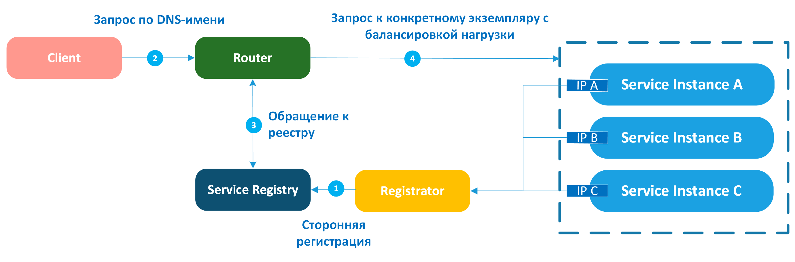