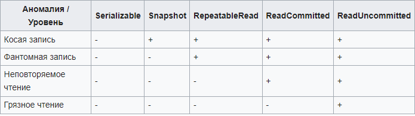
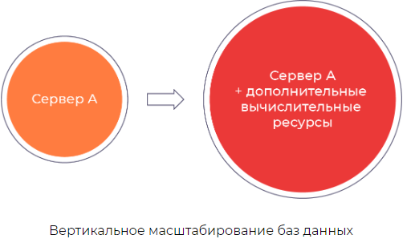
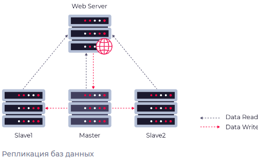
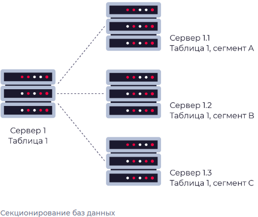
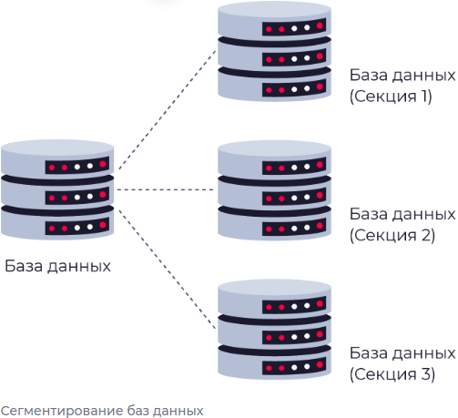

## Теория
- [Проблема N+1 и решение](#проблема-n1-и-решение)
- [Транзакции](#транзакции)
- [Назовите основные свойства транзакции](#назовите-основные-свойства-транзакции)
- [Уровни изоляции бд](#уровни-изоляции-бд)
- [Уровни нормализации](#уровни-нормализации)
- [Способы оптимизации бд (индекс, шардирование, партиционирование)](#способы-оптимизации-бд-индекс-шардирование-партиционирование)
- [Горизонтальное и вертикальное масштабирование](#горизонтальное-и-вертикальное-масштабирование)
- [Что такое _«реляционная модель данных»_?](#что-такое-«реляционная-модель-данных»)
- [Дайте определение терминам _«простой»_, _«составной» (composite)_, _«потенциальный» (candidate)_, _«альтернативный» (alternate)_, _«естественный»_ и _«сурогатный ключ»_.](#дайте-определение-терминам-«простой»-«составной»-composite-«потенциальный»-candidate-«альтернативный»-alternate-«естественный»-и-«сурогатный-ключ»)
- [Что такое _«первичный ключ» (primary key)_? Каковы критерии его выбора?](#что-такое-«первичный-ключ»-primary-key-каковы-критерии-его-выбора)
- [Что такое _«внешний ключ» (foreign key)_?](#что-такое-«внешний-ключ»-foreign-key)
- [Типы связей](#типы-связей)
- [Что такое _«индексы»_? Для чего их используют? В чём заключаются их преимущества и недостатки?](#что-такое-«индексы»-для-чего-их-используют-в-чём-заключаются-их-преимущества-и-недостатки)
- [Какие типы индексов существуют?](#какие-типы-индексов-существуют)
- [В чем отличие между кластерными и некластерными индексами?](#в-чем-отличие-между-кластерными-и-некластерными-индексами)
- [Имеет ли смысл индексировать данные, имеющие небольшое количество возможных значений?](#имеет-ли-смысл-индексировать-данные-имеющие-небольшое-количество-возможных-значений)
- [Когда полное сканирование набора данных выгоднее доступа по индексу?](#когда-полное-сканирование-набора-данных-выгоднее-доступа-по-индексу)
- [Cup теорема](#cup-теорема)
- [Join](#join)


## Проблема N+1 и решение
     (или проблема "жадной" загрузки) - это частое явление при использовании ORM, когда при попытке загрузить данные из связанных таблиц происходит множественный запрос к базе данных вместо одного оптимизированного запроса.

Такая ситуация возникает тогда, когда модель данных имеет связь один ко многим или многие ко многим.

Например, предположим, что у нас есть модель, описывающая клиентов и заказы, где каждый клиент может иметь несколько заказов. Если мы используем ORM для загрузки списка клиентов и решаем получить список всех заказов каждого клиента, то в результате будет выполнено n + 1 запросов к базе данных, где n - количество клиентов, а 1 - запрос на загрузку списка клиентов. Таким образом, если у нас есть 1000 клиентов, то для загрузки списка всех заказов мы будем выполнять 1001 запрос.

Чтобы избежать проблемы n+1, можно использовать ORM-функции для загрузки связанных объектов сразу или использовать более оптимальные запросы к базе данных. Также можно использовать инструменты для профилирования и анализа производительности приложения, чтобы выявлять и оптимизировать медленные участки кода.

## Транзакции
     Последовательности команд, которые должны быть выполнены полностью, либо не выполнены вообще.

## Назовите основные свойства транзакции (ACID)
__Атомарность (atomicity)__ гарантирует, что никакая транзакция не будет зафиксирована в системе частично. Будут либо выполнены все её подоперации, либо не выполнено ни одной. 

__Согласованность (consistency)__. Транзакция, достигающая своего нормального завершения и, тем самым, фиксирующая свои результаты, сохраняет согласованность базы данных.

__Изолированность (isolation)__. Во время выполнения транзакции параллельные транзакции не должны оказывать влияние на её результат.

__Долговечность (durability)__. Независимо от проблем на нижних уровнях (к примеру, обесточивание системы или сбои в оборудовании) изменения, сделанные успешно завершённой транзакцией, должны остаться сохранёнными после возвращения системы в работу.

## Изоляция транзакций
Свойство изолированности говорит нам о том, что:
- в системе могут параллельно исполняться две и более транзакции;
- при этом транзакция должна уметь выполняться так, как будто она в сисетме одна;
- кроме того, если мы выполнили по отдельности набор транзакций параллельно, то при попытке посмотреть на все эти транзакции в совокупности мы должны увидеть, что их совместный результат также корректен.

## Проблемы (аномалии) при параллельной обработке транзакций
`Косая запись`  — аномалия, которая возникает при ситуации когда мы из двух разных транзакций пытаемся изменить одни и те же данные (например, ячейки А и В) так, что первая транзакция затронет ячейку A, а вторая — ячейку В и мы получим неконсистентный результат.

`Фантомная запись` — это аномалия, которая возникает в том случае, когда одна и та же транзакция пытается повторно считать данные из какой-то таблицы, но между двумя этими считываниями какая-то другая транзакция занесла изменения в эту таблицу. В таком случае при повторном чтении мы увидим новые данные, которых не было ранее.

`Неповторяемое чтение` — это аномалия, которая возникает при повторном чтении ячейки таблицы, в которую были между этими чтениями внесены изменения. Таким образом, при повторном чтении мы можем увидеть вовсе не те данные, что были там раньше.

`Грязное чтение` — это аномалия, которая возникает при чтении еще не зафиксированных другой транзакцией изменений. Таким образом, мы можем увидеть данные, которые еще даже не были помечены как внесенные в базу.


## Уровни изоляции бд


`Serializable` 

При этом уровне изоляции мы гарантируем полную упорядочиваемость всех совершаемых транзакций, вследствие чего не возникнет ни одна из аномалий, перечисленных выше. Пример:
```sql
create transaction isolation level serializable;
-- your query goes here
commit;
```

`Snapshot` 

Название этого уровня изоляции на русский язык можно перевести как слепок, что, на самом деле, приводит к тому, что если две транзакции совершаются прааллельно, то каждой из них выдают свой "слепок" базы данных в какой-то определенный момент.

После выполнения всех операций со слепком базы данных (удаление/запись/изменение/чтение) все изменения "вливаются" в основную версию базы. Транзакция будет завершена успешно, если в основной версии базы данных к моменту окончания транзакции ни в одной из ячеек базы, измененных в ходе транзакции, не было изменений за время ее выполнения. Таким образом, если две транзакции выполняли операции над разными частями базы данных, то конфликтов у нас не возникнет и соответствующее слияние произойдет безболезненно. Если же изменялись одни и те же данные, мы можем получить аномалию "косой записи" (см. выше).

Стоит отметить, что формально такого уровня изоляции нет в стандарте языка SQL.

`Repeatable read`

При данном уровне изоляции выполняется гарантия, что при повторном чтении одного и того же поля записи в базе мы будем получать одни и те же значения в ходе транзакции. Исключение составляют те изменения, которые мы сами внесли в базу.

В базах данных, которые реализуют изоляцию посредством блокировок обеспечение такого уровня изоляции будет выполняться за счет блокировки или отдельных записей в таблицах, или страниц в целом.

Пример создания такой транзакции:
```sql
create transaction isolation repeatable read;
-- your query goes here
commit;
```

`Read committed`
При этом уровне изоляции существует гарантия, что мы увидим любые изменения, которые были зафиксированы другими транзакциями. При этом можно заметить, что если мы дважды читаем информацию из одной ячейки, то между этими чтениями другая транзакция могла внести свои изменения, что влечет за собой проблему "неповторяемого чтения".

Стоит отметить, что при таком уровне изоляции базе данных не нужно полностью брать блокировку на запись или таблицу — в этом случае можно использовать частичную блокировку записей или страниц.

Пример создания такой транзакции:
```sql
create transaction isolation read committed;
-- your query goes here
commit;
```

`Read uncommitted`
При таком уровне изоляции транзакций у нас вовсе отсутствуют какие-либо блокировки, следовательно мы ничего не можем гарантировать пользователю. При таком уровне изоляции пользователь увидит любые текущие данные в базе данных, в том числе, он сможет увидеть "грязные данные" — то есть данные, которые еще не были зафиксированы ни одной из транзакций и впоследствии могут быть вовсе откачены.

Транзакции, работающие на уровне изоляции read uncommitted, могут только читать данные, но не изменять их.

Хорошо подойдет, чтобы узнать количество студентов, ведь нам необязательно знать точное количество.

Пример создания такой транзакции:
```sql
create transaction isolation read uncommitted;
-- your query goes here
commit;
```

Источник - [Транзакции. Параллельное исполнение. Уровни изоляции](https://neerc.ifmo.ru/wiki/index.php?title=%D0%A2%D1%80%D0%B0%D0%BD%D0%B7%D0%B0%D0%BA%D1%86%D0%B8%D0%B8._%D0%9F%D0%B0%D1%80%D0%B0%D0%BB%D0%BB%D0%B5%D0%BB%D1%8C%D0%BD%D0%BE%D0%B5_%D0%B8%D1%81%D0%BF%D0%BE%D0%BB%D0%BD%D0%B5%D0%BD%D0%B8%D0%B5._%D0%A3%D1%80%D0%BE%D0%B2%D0%BD%D0%B8_%D0%B8%D0%B7%D0%BE%D0%BB%D1%8F%D1%86%D0%B8%D0%B8#.D0.A3.D1.80.D0.BE.D0.B2.D0.BD.D0.B8_.D0.B8.D0.B7.D0.BE.D0.BB.D1.8F.D1.86.D0.B8.D0.B8_.D1.82.D1.80.D0.B0.D0.BD.D0.B7.D0.B0.D0.BA.D1.86.D0.B8.D0.B9)

## Уровни нормализации
__Первая нормальная форма (1NF)__ - Отношение находится в 1NF, если значения всех его атрибутов атомарны (неделимы). 

__Вторая нормальная форма (2NF)__ - Отношение находится в 2NF, если оно находится в 1NF, и при этом все неключевые атрибуты зависят только от ключа целиком, а не от какой-то его части.

__Третья нормальная форма (3NF)__ - Отношение находится в 3NF, если оно находится в 2NF и все неключевые атрибуты не зависят друг от друга.

__Четвёртая нормальная форма (4NF)__ - Отношение находится в 4NF , если оно находится в 3NF и если в нем не содержатся независимые группы атрибутов, между которыми существует отношение «многие-ко-многим».

__Пятая нормальная форма (5NF)__ - Отношение находится в 5NF, когда каждая нетривиальная зависимость соединения в ней определяется потенциальным ключом (ключами) этого отношения.

__Шестая нормальная форма (6NF)__ - Отношение находится в 6NF, когда она удовлетворяет всем нетривиальным зависимостям соединения, т.е. когда она неприводима, то есть не может быть подвергнута дальнейшей декомпозиции без потерь. Каждая переменная отношения, которая находится в 6NF, также находится и в 5NF. Введена как обобщение пятой нормальной формы для хронологической базы данных.

__Нормальная форма Бойса-Кодда, усиленная 3 нормальная форма (BCNF)__ - Отношение находится в BCNF, когда каждая её нетривиальная и неприводимая слева функциональная зависимость имеет в качестве своего детерминанта некоторый потенциальный ключ.

__Доменно-ключевая нормальная форма (DKNF)__ -  Отношение находится в DKNF, когда каждое наложенное на неё ограничение является логическим следствием ограничений доменов и ограничений ключей, наложенных на данное отношение.

## Способы оптимизации бд
- Горизонтальное и вертикальное масштабирование
- Создайте индексы для часто запрашиваемых столбцов
     > Индекс - структура данных, позволяющая быстро определить положение интересующих данных в базе.
- настройте конфигурацию базы данных под ваше приложение 
- оптимизируйте запросы, которые используются для доступа к данным.


## Горизонтальное и вертикальное масштабирование
__Вертикальное масштабирование__ - предполагает наращивание мощностей сервера. Основным преимуществом метода является его простота. Нет необходимости переписывать код при добавлении мощностей, а управлять одним крупным сервером намного проще, чем целой системой. Это же является и основным недостатком — масштабирование ресурсов одного сервера имеет вполне конкретные аппаратные ограничения. Также стоит учесть стоимость такого решения: сервер с кратным объёмом вычислительных ресурсов в большинстве случаев оказывается дороже, чем несколько менее мощных серверов, дающих в сумме такую производительность.



__Горизонтальное масштабирование__ - означает увеличение производительности за счёт разделения данных на множество серверов. Такой способ предполагает увеличение производительности без снижения отказоустойчивости. 


Существует три основных типа горизонтального масштабирования.
- __Репликация__ - подразумевает копирование данных между серверами. При использовании такого метода выделяют два типа серверов: master и slave. Мастер используется для записи или изменения информации, слейвы — для копирования информации с мастера и её чтения. Чаще всего используется один мастер и несколько слейвов, так как обычно запросов на чтение больше, чем запросов на изменение. Главное преимущество репликации — большое количество копий данных. Так, если даже головной сервер выходит из строя, любой другой сможет его заменить. Однако как механизм масштабирования репликация не слишком удобна. Причина тому — рассинхронизация и задержки при передаче данных между серверами. Чаще всего репликация используется как средство для обеспечения отказоустойчивости вместе с другими методами масштабирования.

     

- __Партицирование/секционирование__ - Данный метод масштабирования заключается в разбиении данных на части по какому-либо признаку. Например, таблицу можно разбить на две по признаку чётности. Причиной для использования партицирования является необходимость в повышении производительности. Это происходит из-за того, что поиск осуществляется не по всей таблице, а лишь по её части. Другим преимуществом этого метода является возможность быстрого удаления неактуального фрагмента таблицы.

     

- __Шардирование/шардинг/сегментирование__ - это принцип проектирования базы данных, при котором части таблицы хранятся раздельно, на разных физических серверах. Шардинг является наиболее приемлемым решением для крупномасштабной деятельности, особенно если его использовать в паре с репликацией. Но стоит отметить, что это достаточно сложно организовать, так как необходимо учитывать межсерверное взаимодействие.

     

## Что такое _«реляционная модель данных»_?
__Реляционная модель данных__ — это логическая модель данных и прикладная теория построения реляционных баз данных. Термин «реляционный» означает, что теория основана на математическом понятии отношение (relation), которая формально определяет свойства различных объектов и их взаимосвязи.

Реляционная модель данных включает в себя следующие компоненты:

+ _Структурный аспект_ — данные представляют собой набор отношений.
+ _Аспект целостности_ — отношения отвечают определенным условиям целостности: уровня домена (типа данных), уровня отношения и уровня базы данных.
+ _Аспект обработки (манипулирования)_ — поддержка операторов манипулирования отношениями (реляционная алгебра, реляционное исчисление).
+ _Нормальная форма_ - свойство отношения в реляционной модели данных, характеризующее его с точки зрения избыточности и определённое как совокупность требований, которым должно удовлетворять отношение.


## Дайте определение терминам _«простой»_, _«составной» (composite)_, _«потенциальный» (candidate)_, _«альтернативный» (alternate)_, _«естественный»_ и _«сурогатный ключ»_.
__Простой ключ__ состоит из одного атрибута (поля). __Составной__ - из двух и более.

__Потенциальный ключ__ - простой или составной ключ, который уникально идентифицирует каждую запись набора данных. При этом потенциальный ключ должен обладать критерием неизбыточности: при удалении любого из полей набор полей перестает уникально идентифицировать запись.

Из множества всех потенциальных ключей набора данных выбирают первичный ключ, все остальные ключи называют __альтернативными__.

__Естественный Ключ__ – набор атрибутов описываемой записью сущности, уникально её идентифицирующий (например, номер паспорта для человека)

__Суррогатный Ключ__ – автоматически сгенерированное поле, никак не связанное с информационным содержанием записи. Обычно в роли СК выступает автоинкрементное поле типа INTEGER.


## Что такое _«первичный ключ» (primary key)_? Каковы критерии его выбора?
__Первичный ключ (primary key)__ уникальный идентификатор записи в табице. В реляционной модели данных один из _потенциальных ключей_ отношения, выбранный в качестве основного ключа (ключа по умолчанию).

Если в отношении имеется единственный потенциальный ключ, он является и первичным ключом. Если потенциальных ключей несколько, один из них выбирается в качестве первичного, а другие называют _«альтернативными»_.

В качестве первичного обычно выбирается тот из потенциальных ключей, который наиболее удобен. Поэтому в качестве первичного ключа, как правило, выбирают тот, который имеет наименьший размер (физического хранения) и/или включает наименьшее количество атрибутов. Другой критерий выбора первичного ключа — сохранение его уникальности со временем. Поэтому в качестве первичного ключа стараются выбирать такой потенциальный ключ, который с наибольшей вероятностью никогда не утратит уникальность.

## Что такое _«внешний ключ» (foreign key)_?
__Внешний ключ (foreign key)__ — подмножество атрибутов некоторого отношения A, значения которых должны совпадать со значениями некоторого потенциального ключа некоторого отношения B.

Внешние ключи позволяют установить связи между таблицами. Внешний ключ устанавливается для столбцов из зависимой, подчиненной таблицы, и указывает на один из столбцов из главной таблицы. Как правило, __внешний ключ указывает на первичный ключ из связанной главной таблицы__

## Типы связей
+ __OneToOne ОдинКОдному__
+ __OneToMany ОдинКоМногим__
+ __ManyToOne МногиеКОдному__
+ __ManyToMany МногиеКоМногим__

Каждую из которых можно разделить еще на два вида:
+ __Bidirectional (пер. - Двунаправленный)__ - две связи
+ __Unidirectional (пер. - Однонаправленный)__ — ссылка на связь устанавливается у всех Entity, то есть в случае OneToOne A-B в Entity A есть ссылка на Entity B, в Entity B есть ссылка на Entity A, Entity A считается владельцем этой связи (это важно для случаев каскадного удаления данных, тогда при удалении A также будет удалено B, но не наоборот).Unidirectional - ссылка на связь устанавливается только с одной стороны, то есть в случае OneToOne A-B только у Entity A будет ссылка на Entity B, у Entity B ссылки на A не будет.

## Что такое _«индексы»_? Для чего их используют? В чём заключаются их преимущества и недостатки?
__Индекс (index)__ — объект базы данных (отдельная таблица), создаваемый с целью повышения производительности выборки данных. Как закладка у книги.

Наборы данных могут иметь большое количество записей, которые хранятся в произвольном порядке, и их поиск по заданному критерию путём последовательного просмотра набора данных запись за записью может занимать много времени. Индекс формируется из значений одного или нескольких полей и указателей на соответствующие записи набора данных, - таким образом, достигается значительный прирост скорости выборки из этих данных.

```sql
CREATE INDEX имя_индекса ON имя_таблицы;
```

Преимущества

+ ускорение поиска и сортировки по определенному полю или набору полей.
+ обеспечение уникальности данных.

Недостатки 

+ требование дополнительного места на диске и в оперативной памяти и чем больше/длиннее ключ, тем больше размер индекса.
+ замедление операций вставки, обновления и удаления записей, поскольку при этом приходится обновлять сами индексы.

Индексы предпочтительней для:

+ Поля-счетчика, чтобы в том числе избежать и повторения значений в этом поле;
+ Поля, по которому проводится сортировка данных;
+ Полей, по которым часто проводится соединение наборов данных. Поскольку в этом случае данные располагаются в порядке возрастания индекса и соединение происходит значительно быстрее;
+ Поля, которое объявлено первичным ключом (primary key);
+ Поля, в котором данные выбираются из некоторого диапазона. В этом случае как только будет найдена первая запись с нужным значением, все последующие значения будут расположены рядом.
 
Использование индексов нецелесообразно для:

+ Полей, которые редко используются в запросах;
+ Полей, которые содержат всего два или три значения, например: _мужской_,  _женский пол_ или значения _«да»_, _«нет»_.


## Какие типы индексов существуют?

__По порядку сортировки__
+ _упорядоченные_ — индексы, в которых элементы упорядочены;
+ _возрастающие_;
+ _убывающие_;
+ _неупорядоченные_ — индексы, в которых элементы неупорядочены.

__По источнику данных__
+ _индексы по представлению (view)_;
+ _индексы по выражениям_.

__По воздействию на источник данных__
+ _кластерный индекс_ - при определении в наборе данных физическое расположение данных перестраивается в соответствии со структурой индекса. Логическая структура набора данных в этом случае представляет собой скорее словарь, чем индекс. Данные в словаре физически упорядочены, например по алфавиту. Кластерные индексы могут дать существенное увеличение производительности поиска данных даже по сравнению с обычными индексами. Увеличение производительности особенно заметно при работе с последовательными данными.
+ _некластерный индекс_ — наиболее типичные представители семейства индексов. В отличие от кластерных, они не перестраивают физическую структуру набора данных, а лишь организуют ссылки на соответствующие записи. Для идентификации нужной записи в наборе данных некластерный индекс организует специальные указатели, включающие в себя: информацию об идентификационном номере файла, в котором хранится запись; идентификационный номер страницы соответствующих данных; номер искомой записи на соответствующей странице; содержимое столбца.

__По структуре__
+ _B*-деревья_;
+ _B+-деревья_;
+ _B-деревья_;
+ _Хэши_.

__По количественному составу__
+ _простой индекс (индекс с одним ключом)_ — строится по одному полю;
+ _составной (многоключевой, композитный) индекс_ — строится по нескольким полям при этом важен порядок их следования;
+ _индекс с включенными столбцами_ — некластеризованный индекс, дополнительно содержащий кроме ключевых столбцов еще и неключевые;
+ _главный индекс (индекс по первичному ключу)_ — это тот индексный ключ, под управлением которого в данный момент находится набор данных. Набор данных не может быть отсортирован по нескольким индексным ключам одновременно. Хотя, если один и тот же набор данных открыт одновременно в нескольких рабочих областях, то у каждой копии набора данных может быть назначен свой главный индекс.

__По характеристике содержимого__
+ _уникальный индекс_ состоит из множества уникальных значений поля;
+ _плотный индекс_ (NoSQL) — индекс, при котором, каждом документе в индексируемой коллекции соответствует запись в индексе, даже если в документе нет индексируемого поля.
+ _разреженный индекс_ (NoSQL) — тот, в котором представлены только те документы, для которых индексируемый ключ имеет какое-то определённое значение (существует).
+ _пространственный индекс_ — оптимизирован для описания географического местоположения. Представляет из себя многоключевой индекс состоящий из широты и долготы.
+ _составной пространственный индекс_ — индекс, включающий в себя кроме широты и долготы ещё какие-либо мета-данные (например теги). Но географические координаты должны стоять на первом месте.
+ _полнотекстовый (инвертированный) индекс_ — словарь, в котором перечислены все слова и указано, в каких местах они встречаются. При наличии такого индекса достаточно осуществить поиск нужных слов в нём и тогда сразу же будет получен список документов, в которых они встречаются.
+ _хэш-индекс_ предполагает хранение не самих значений, а их хэшей, благодаря чему уменьшается размер (а, соответственно, и увеличивается скорость их обработки) индексов из больших полей. Таким образом, при запросах с использованием хэш-индексов, сравниваться будут не искомое со значения поля, а хэш от искомого значения с хэшами полей.
Из-за нелинейнойсти хэш-функций данный индекс нельзя сортировать по значению, что приводит к невозможности использования в сравнениях больше/меньше и «is null». Кроме того, так как хэши не уникальны, то для совпадающих хэшей применяются методы разрешения коллизий.
+ _битовый индекс (bitmap index)_ — метод битовых индексов заключается в создании отдельных битовых карт (последовательностей 0 и 1) для каждого возможного значения столбца, где каждому биту соответствует запись с индексируемым значением, а его значение равное 1 означает, что запись, соответствующая позиции бита содержит индексируемое значение для данного столбца или свойства.
+ _обратный индекс (reverse index)_ — B-tree индекс, но с реверсированным ключом, используемый в основном для монотонно возрастающих значений (например, автоинкрементный идентификатор) в OLTP системах с целью снятия конкуренции за последний листовой блок индекса, т.к. благодаря переворачиванию значения две соседние записи индекса попадают в разные блоки индекса. Он не может использоваться для диапазонного поиска.
+ _функциональный индекс, индекс по вычисляемому полю (function-based index)_ — индекс, ключи которого хранят результат пользовательских функций. Функциональные индексы часто строятся для полей, значения которых проходят предварительную обработку перед сравнением в команде SQL. Например, при сравнении строковых данных без учета регистра символов часто используется функция UPPER. Кроме того, функциональный индекс может помочь реализовать любой другой отсутствующий тип индексов данной СУБД.
+ _первичный индекс_ — уникальный индекс по полю первичного ключа.
+ _вторичный индекс_ — индекс по другим полям (кроме поля первичного ключа).
+ _XML-индекс_ — вырезанное материализованное представление больших двоичных XML-объектов (BLOB) в столбце с типом данных xml.

__По механизму обновления__
+ _полностью перестраиваемый_ — при добавлении элемента заново перестраивается весь индекс.
+ _пополняемый (балансируемый)_ — при добавлении элементов индекс перестраивается частично (например одна из ветви) и периодически балансируется.

__По покрытию индексируемого содержимого__
+ _полностью покрывающий (полный) индекс_ — покрывает всё содержимое индексируемого объекта.
+ _частичный индекс (partial index)_ — это индекс, построенный на части набора данных, удовлетворяющей определенному условию самого индекса. Данный индекс создан для уменьшения размера индекса.
+ _инкрементный (delta) индекс_ — индексируется малая часть данных(дельта), как правило, по истечении определённого времени. Используется при интенсивной записи. Например, полный индекс перестраивается раз в сутки, а дельта-индекс строится каждый час. По сути это частичный индекс по временной метке.
+ _индекс реального времени (real-time index)_ — особый вид инкрементного индекса, характеризующийся высокой скоростью построения. Предназначен для часто меняющихся данных.

__Индексы в кластерных системах__
+ _глобальный индекс_ — индекс по всему содержимому всех сегментов БД (shard).
+ _сегментный индекс_ — глобальный индекс по полю-сегментируемому ключу (shard key). Используется для быстрого определения сегмента, на котором хранятся данные в процессе маршрутизации запроса в кластере БД.
+ _локальный индекс_ —  индекс по содержимому только одного сегмента БД.


## В чем отличие между кластерными и некластерными индексами?
Некластерные индексы - данные физически расположены в произвольном порядке, но логически упорядочены согласно индексу. Такой тип индексов подходит для часто изменяемого набора данных.

При кластерном индексировании данные физически упорядочены, что серьезно повышает скорость выборок данных (но только в случае последовательного доступа к данным). Для одного набора данных может быть создан только один кластерный индекс.


## Имеет ли смысл индексировать данные, имеющие небольшое количество возможных значений?
Примерное правило, которым можно руководствоваться при создании индекса - если объем информации (в байтах) НЕ удовлетворяющей условию выборки меньше, чем размер индекса (в байтах) по данному условию выборки, то в общем случае оптимизация приведет к замедлению выборки.

## Когда полное сканирование набора данных выгоднее доступа по индексу?
Полное сканирование производится многоблочным чтением. Сканирование по индексу - одноблочным. Также, при доступе по индексу сначала идет сканирование самого индекса, а затем чтение блоков из набора данных. Число блоков, которые надо при этом прочитать из набора зависит от фактора кластеризации. Если суммарная стоимость всех необходимых одноблочных чтений больше стоимости полного сканирования многоблочным чтением, то полное сканирование выгоднее и оно выбирается оптимизатором.

Таким образом, полное сканирование выбирается при слабой селективности предикатов зароса и/или слабой кластеризации данных, либо в случае очень маленьких наборов данных.


## Cup теорема
Она гласит, что в распределенной системе можно обеспечить только два свойства из трех: согласованность, доступность и устойчивость к разделению. Помогает понимать, как конкретная распределенная система будет работать и какую систему базы данных (например Postgresql или MySql) лучше выбрать. Однако многими учёными и практиками теорема CAP критикуется за вольность трактовки и даже недостоверность.

__Согласованность данных (consistency)__
Когда во всех узлах в каждый момент времени данные согласованы друг с другом, то есть не противоречат друг другу. Если в одном из узлов в ячейке базы данных есть данные, такие же данные есть на всех остальных узлах.

__Доступность (availability)__
Когда любой запрос может быть обработан системой, вне зависимости от ее состояния.

__Устойчивость к разделению (partition tolerance)__
Когда расщепление системы на несколько изолированных секций не приводит к некорректному отклику от каждой из секций: отвалилась сеть между двумя узлами, но каждый из них может корректно отвечать своим клиентам.


## Join
__JOIN__ - оператор языка SQL, который является реализацией операции соединения реляционной алгебры. Предназначен для обеспечения выборки данных из двух таблиц и включения этих данных в один результирующий набор. 

Особенностями операции соединения являются следующее:

+ в схему таблицы-результата входят столбцы обеих исходных таблиц (таблиц-операндов), то есть схема результата является «сцеплением» схем операндов;
+ каждая строка таблицы-результата является «сцеплением» строки из одной таблицы-операнда со строкой второй таблицы-операнда;
+ при необходимости соединения не двух, а нескольких таблиц, операция соединения применяется несколько раз (последовательно).

```sql
SELECT
  field_name [,... n]
FROM
  Table1
  {INNER | {LEFT | RIGHT | FULL} OUTER | CROSS } JOIN
  Table2
    {ON <condition> | USING (field_name [,... n])}
```


### Типы `JOIN`:

__(INNER) JOIN__
Результатом объединения таблиц являются записи, общие для левой и правой таблиц. Порядок таблиц для оператора не важен, поскольку оператор является симметричным.

__LEFT (OUTER) JOIN__
Производит выбор всех записей первой таблицы и соответствующих им записей второй таблицы. Если записи во второй таблице не найдены, то вместо них подставляется пустой результат (`NULL`). Порядок таблиц для оператора важен, поскольку оператор не является симметричным.

__RIGHT (OUTER) JOIN__
`LEFT JOIN` с операндами, расставленными в обратном порядке. Порядок таблиц для оператора важен, поскольку оператор не является симметричным.

__FULL (OUTER) JOIN__
Результатом объединения таблиц являются все записи, которые присутствуют в таблицах. Порядок таблиц для оператора не важен, поскольку оператор является симметричным.

__CROSS JOIN (декартово произведение)__
При выборе каждая строка одной таблицы объединяется с каждой строкой второй таблицы, давая тем самым все возможные сочетания строк двух таблиц. Порядок таблиц для оператора не важен, поскольку оператор является симметричным.