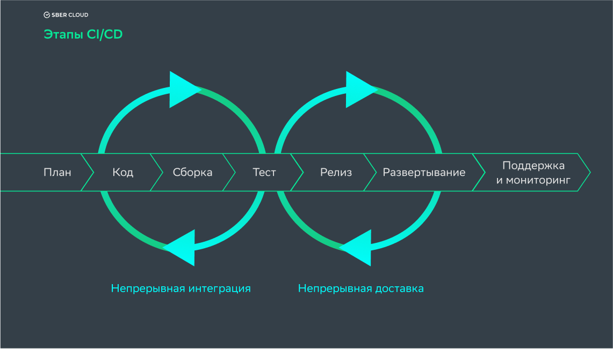

# DevOps
- [Что такое DevOps?](#что-такое-devops)
- [CI/CD](#cicd)
- [Организация процесса CI/CD](#организация-процесса-cicd)

# Что такое DevOps?

# CI/CD
__CI/CD (Continuous Integration/Continuous Deployment)__ - это методология разработки программного обеспечения, которая позволяет автоматизировать процесс сборки, тестирования и развертывания приложений. Она помогает ускорить и упростить процесс разработки, улучшить качество кода и обеспечить быструю доставку изменений в продакшн.

__Continuous Integration (CI)__ - это практика, при которой разработчики регулярно интегрируют свой код в общий репозиторий. При каждой интеграции происходит автоматическая сборка и запуск набора тестов для проверки работоспособности кода. Это позволяет выявлять и исправлять ошибки на ранних стадиях разработки.

__Continuous Deployment (CD)__ - это практика, при которой каждое успешное изменение кода автоматически разворачивается на целевой среде (например, на тестовом или продакшн сервере). Это позволяет быстро доставлять новые функции и исправления багов пользователям.

__Цели CI/CD:__
+ обеспечение последовательного и автоматизированного способа сборки, упаковки и тестирования;
+ автоматизация развёртывания в разных окружениях;
+ сведение к минимуму ошибок и проблем.

__Плюсы:__
1. Минимальное время от запроса клиента до запуска в использование — мы быстрее доставляем новые фичи
2. Возможность проверки вариантов — можем моментально проверять изменения и при необходимости откатывать назад
3. Качество результата — можем быстро обнаружить и пофиксить ошибки

__Минусы:__
1. Сложность обеспечения взаимодействия — и DevOps-инженеры, и разработчики должны понимать, что было сделано и зачем
2. Требования к опыту — нужен опыт настройки CI/CD, который почти всегда добывается с болью

## Принципы CI/CD
1. __Разделение активности__ - каждый из участников процесса делит ответственность за жизненные циклы продукта. Проектируется бизнес-логика, выбираются сквозные функции, проводятся тесты, организуется доставка кода из одного окружения в другое.
2. __Снижение рисков__ - чтобы баги не доходили до продакшена, контролируется корректность бизнес-логики, проверяется пользовательский опыт на стендах, улучшается процесс хранения и обработки данных. Чем раньше мы обнаружим риск, тем быстрее идентифицируем проблему и тем меньше средств потратим на её решение.
3. __Сокращение цикла обратной связи__ - в рамках CI/CD мы стремимся увеличить скорость внесения изменений и согласования правок.
4. __Реализация среды__ - у разработчиков должно быть общее пространство для работы с основной веткой или со вспомогательными ветками. Это пространство должно быть отказоустойчивым и удобным для работы. 

## Организация процесса CI/CD

__Организация процесса CI/CD__ включает в себя следующие шаги:

+ __Планирование__:  Обычно за этот этап отвечают люди из анализа: они переводят требования с языка бизнеса на язык, понятный разработчикам и администраторам.
+ __Управление версиями кода__: Использование системы контроля версий (например, Git) для хранения и отслеживания изменений в коде.
+ __Автоматическая сборка__: Настройка системы сборки (например, Maven, Gradle или Jenkins) для автоматической сборки приложения после каждого коммита в репозиторий.
+ __Автоматическое тестирование__: Настройка автоматического запуска набора тестов (например, модульных, интеграционных и функциональных тестов) после каждой сборки. Тесты должны проверять работоспособность кода и выявлять возможные ошибки.
+ __Автоматическое развертывание__: Настройка процесса автоматического развертывания приложения на целевой среде после успешного прохождения всех тестов. Это может включать в себя создание контейнеров (например, Docker), установку зависимостей и настройку окружения.
+ __Мониторинг и логирование__: Настройка системы мониторинга и логирования для отслеживания работы приложения в реальном времени. Это позволяет быстро обнаруживать и исправлять проблемы в процессе развертывания.
+ __Откат изменений__: В случае возникновения проблем после развертывания, необходимо иметь механизм для отката изменений и возврата к предыдущей стабильной версии приложения.
+ __Непрерывное улучшение__: Постоянное улучшение процесса CI/CD путем анализа результатов тестирования, сбора обратной связи от пользователей и внедрения новых инструментов и практик.

Внедрение и настройка процесса CI/CD требует определенных навыков и инструментов. Некоторые из популярных инструментов для организации CI/CD включают _Jenkins, GitLab CI/CD, CircleCI, Travis CI и AWS CodePipeline_.

Организация процесса CI/CD позволяет командам разработчиков быстро и надежно доставлять изменения в продакшн, улучшать качество кода и повышать эффективность разработки. Это особенно важно в современных динамичных и быстроразвивающихся проектах.

## Источники
- [Основы CI/CD. Знакомство с Jenkins](#https://habr.com/ru/companies/slurm/articles/691876/)