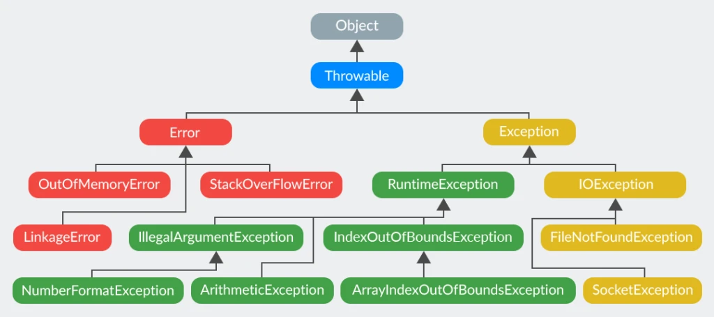
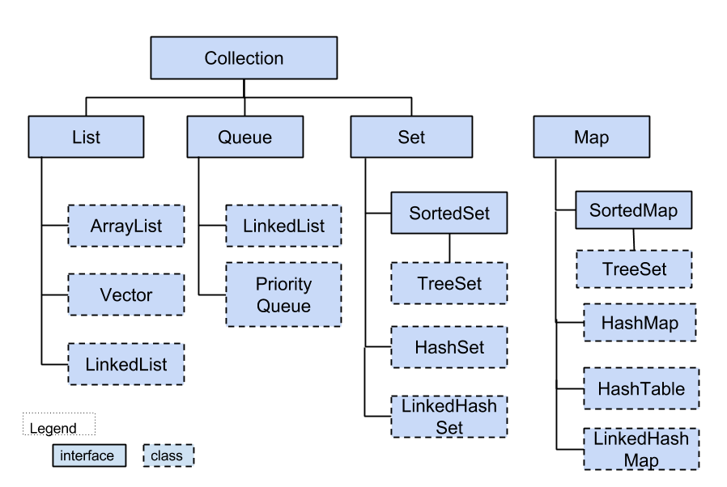

# Java core
- [В чем разница между checked и unchecked исключениями?](#в-чем-разница-между-checked-и-unchecked-исключениями)
- [Какие существуют unchecked exception?](#какие-существуют-unchecked-exception)
- [Какие особенности использования оператора try...catch знаете?](#какие-особенности-использования-оператора-trycatch-знаете)
- [Что представляет из себя ошибки класса Error?](#что-представляет-из-себя-ошибки-класса-error)
- [В чем разница между error и exception?](#в-чем-разница-между-error-и-exception)
- [Опишите иерархию исключений](#опишите-иерархию-исключений)
- [Возможно ли использование блока try-finally (без catch)?](#возможно-ли-использование-блока-try-finally-без-catch)
- [Может ли метод main() выбросить исключение во вне и если да, то где будет происходить обработка данного исключения?](#может-ли-метод-main-выбросить-исключение-во-вне-и-если-да-то-где-будет-происходить-обработка-данного-исключения)
- [Какой оператор позволяет принудительно выбросить исключение?](#какой-оператор-позволяет-принудительно-выбросить-исключение)
- [О чем говорит ключевое слово throws?](#о-чем-говорит-ключевое-слово-throws)
- [Как написать собственное («пользовательское») исключение?](#как-написать-собственное-«пользовательское»-исключение)
- [Когда в приложении может быть выброшено исключение `ClassCastException`](#когда-в-приложении-может-быть-выброшено-исключение-classcastexception)
- [Что вы знаете о `OutOfMemoryError`?](#что-вы-знаете-о-outofmemoryerror)
- [Опишите работу блока _try-catch-finally_](#опишите-работу-блока-try-catch-finally)
- [Что такое механизм try-with-resources?](#что-такое-механизм-try-with-resources)
- [Может ли один блок catch отлавливать сразу несколько исключений?](#может-ли-один-блок-catch-отлавливать-сразу-несколько-исключений)
- [Предположим, есть метод, который может выбросить IOException и FileNotFoundException в какой последовательности должны идти блоки catch? Сколько блоков catch будет выполнено?](#предположим-есть-метод-который-может-выбросить-ioexception-и-filenotfoundexception-в-какой-последовательности-должны-идти-блоки-catch-сколько-блоков-catch-будет-выполнено)
- [Что такое generics?](#что-такое-generics)
- [Что такое «интернационализация», «локализация»?](#что-такое-«интернационализация»-«локализация»)
- [Что такое класс `Object`? Какие в нем есть методы?](#что-такое-класс-object-какие-в-нем-есть-методы)
- [Кто __НЕ__ наследуется от класса `Object`?](#кто-не-наследуется-от-класса-object)
- [Расскажи об иерархии коллекций в Java](#расскажи-об-иерархии-коллекций-в-java)
- [Почему `Map` — это не `Collection`, в то время как `List` и `Set` являются `Collection`?](#почему-map--это-не-collection-в-то-время-как-list-и-set-являются-collection)
- [`LinkedHashMap` - что в нем от `LinkedList`, а что от `HashMap`?](#linkedhashmap---что-в-нем-от-linkedlist-а-что-от-hashmap)
- [В чем проявляется «сортированность» `SortedMap`, кроме того, что `toString()` выводит все элементы по порядку?](#в-чем-проявляется-«сортированность»-sortedmap-кроме-того-что-tostring-выводит-все-элементы-по-порядку)
- [Как устроен `HashMap`?](#как-устроен-hashmap)
- [Какое начальное количество корзин в `HashMap`?](#какое-начальное-количество-корзин-в-hashmap)
- [Какие дополнительные методы для работы с ассоциативными массивами (maps) появились в Java 8?](#какие-дополнительные-методы-для-работы-с-ассоциативными-массивами-maps-появились-в-java-8)
- [Чем отличаются LinkedList и ArrayList?](#чем-отличаются-linkedlist-и-arraylist)
- [В чем разница между классами `java.util.Collection` и `java.util.Collections`?](#в-чем-разница-между-классами-javautilcollection-и-javautilcollections)
- [Что такое «fail-fast поведение»?](#что-такое-«fail-fast-поведение»)
- [Какая разница между fail-fast и fail-safe?](#какая-разница-между-fail-fast-и-fail-safe)
- [Приведите примеры итераторов, реализующих поведение fail-safe](#приведите-примеры-итераторов-реализующих-поведение-fail-safe)
- [Чем различаются `Enumeration` и `Iterator`?](#чем-различаются-enumeration-и-iterator)
- [Для чего используют Equals and HashCode в Java? Расскажите о контракте между Equals and HashCode в Java?](#для-чего-используют-equals-and-hashcode-в-java-расскажите-о-контракте-между-equals-and-hashcode-в-java)
- [Что такое коллизия в HashCode? Как с ней бороться?](#что-такое-коллизия-в-hashcode-как-с-ней-бороться)
- [Что такое `default` методы интрефейса?](#что-такое-default-методы-интрефейса)
- [Как вызывать `default` метод интерфейса в реализующем этот интерфейс классе?](#как-вызывать-default-метод-интерфейса-в-реализующем-этот-интерфейс-классе)
- [Что такое `StringJoiner`?](#что-такое-stringjoiner)

## В чем разница между checked и unchecked исключениями?
В Java исключения объединены в иерархическую структуру классов, начиная с класса Throwable. Все исключения делятся на два типа:

+ __checked (контролируемые/проверяемые исключения)__ должны быть обработаны в коде программы, иначе код не будет скомпилирован
+ __unchecked (неконтролируемые/непроверяемые исключения)__ (наследники класса RuntimeException) могут возникнуть в любой части кода и не требуют явной обработки

## Какие существуют unchecked exception?
Наиболее часто встречающиеся: 
- ArithmeticException, 
- ClassCastException, 
- ConcurrentModificationException, 
- IllegalArgumentException, 
- IllegalStateException, 
- IndexOutOfBoundsException, 
- NoSuchElementException, 
- NullPointerException, 
- UnsupportedOperationException.

## Какие особенности использования оператора try...catch знаете?
Оператор try-catch используется в Java для обработки исключений. Вот некоторые его особенности:

+ Блок try содержит код, который может породить исключение.
+ Блок catch содержит код, который будет выполняться при возникновении исключения. Мы можем указать тип исключения, которое мы хотим обработать, и обрабатывать их по отдельности.
+ Один блок try может иметь несколько блоков catch, каждый из которых обрабатывает определенный тип исключения.
+ Можно использовать блок finally, который содержит код, который нужно выполнить в любом случае после завершения блока try-catch. Например, можно закрыть файл или соединение с базой данных в блоке finally.
+ Если исключение не было обработано в блоке try-catch, оно передается в более высокий уровень иерархии вызовов, где может быть обработано в другом блоке try-catch.

## Что представляет из себя ошибки класса Error?
Ошибки класса Error представляют собой наиболее серьёзные проблемы уровня JVM. Например, исключения такого рода возникают, если закончилась память доступная виртуальной машине. Обрабатывать такие ошибки не запрещается, но делать этого не рекомендуется.

## В чем разница между error и exception?
В Java классы Exception и Error являются потомками класса Throwable и представляют разные типы проблем, которые могут возникнуть в программе.

Exception обычно возникает из-за ошибок в коде программы или некоторых внешних условий, таких как некорректный ввод пользователя, проблемы с соединением или файловой системой. Исключения должны быть обработаны программным кодом при помощи блока try-catch или выброса исключения для более высокого уровня.

С другой стороны, Error обычно возникает в критических ситуациях, связанных с работой JVM. Это могут быть проблемы с памятью, отказ жесткого диска, невозможность загрузки класса и т.д. Стандартная рекомендация для программирования на Java - не пытаться обрабатывать ошибки (Error), так как они обычно не поддаются коррекции на уровне программного кода.

Класс Error и его подклассы не требуют перехвата и обработки, поскольку они обычно возникают в критических ситуациях, когда дальнейшее выполнение программы может быть проблематичным. Обычно лучшим решением будет прервать выполнение программы и сообщить об ошибке пользователю или администратору системы.

## Опишите иерархию исключений


## Возможно ли использование блока try-finally (без catch)?
Такая запись допустима, но смысла в такой записи не так много, всё же лучше иметь блок `catch`, в котором будет обрабатываться необходимое исключение.

## Может ли метод main() выбросить исключение во вне и если да, то где будет происходить обработка данного исключения?
Может и оно будет передано в виртуальную машину Java (JVM).

## Какой оператор позволяет принудительно выбросить исключение?
Это оператор `throw`:

```java
throw new Exception();
```

## О чем говорит ключевое слово `throws`?
Модификатор `throws` прописывается в заголовке метода и указывает на то, что метод потенциально может выбросить исключение с указанным типом.

## Как написать собственное («пользовательское») исключение?
Необходимо унаследоваться от базового класса требуемого типа исключений (например, от `Exception` или `RuntimeException`).

```java
class CustomException extends Exception {
    public CustomException() {
        super();
    }

    public CustomException(final String string) {
        super(string + " is invalid");
    }

    public CustomException(final Throwable cause) {
        super(cause);
    }
}
```

## Когда в приложении может быть выброшено исключение `ClassCastException`?
`ClassCastException` (потомок `RuntimeException`) - исключение, которое будет выброшено при ошибке приведения типа.

## Что вы знаете о `OutOfMemoryError`?
`OutOfMemoryError` выбрасывается, когда виртуальная машина Java не может создать (разместить) объект из-за нехватки памяти, а сборщик мусора не может высвободить достаточное её количество.

Область памяти, занимаемая java процессом, состоит из нескольких частей. Тип `OutOfMemoryError` зависит от того, в какой из них не хватило места:

+ `java.lang.OutOfMemoryError: Java heap space`: Не хватает места в куче, а именно, в области памяти в которую помещаются объекты, создаваемые в приложении программно. Обычно проблема кроется в утечке памяти. Размер задается параметрами `-Xms` и `-Xmx`.
+ `java.lang.OutOfMemoryError: PermGen space`: (до версии Java 8) Данная ошибка возникает при нехватке места в _Permanent_ области, размер которой задается параметрами `-XX:PermSize` и `-XX:MaxPermSize`.
+ `java.lang.OutOfMemoryError: GC overhead limit exceeded`: Данная ошибка может возникнуть как при переполнении первой, так и второй областей. Связана она с тем, что памяти осталось мало и сборщик мусора постоянно работает, пытаясь высвободить немного места. Данную ошибку можно отключить с помощью параметра `-XX:-UseGCOverheadLimit`.
+ `java.lang.OutOfMemoryError: unable to create new native thread`: Выбрасывается, когда нет возможности создавать новые потоки.

## Опишите работу блока _try-catch-finally_.
```java
try { 
    //код, который потенциально может привести к исключительной ситуации 
} 
catch(SomeException e ) { //в скобках указывается класс конкретной ожидаемой ошибки  
    //код обработки исключительной ситуации
} 
finally {
    //необязательный блок, код которого выполняется в любом случае
}
```

## Что такое механизм try-with-resources?
Данная конструкция, которая появилась в Java 7, позволяет использовать блок _try-catch_ не заботясь о закрытии ресурсов, используемых в данном сегменте кода.
Ресурсы объявляются в скобках сразу после `try`, а компилятор уже сам неявно создаёт секцию `finally`, в которой и происходит освобождение занятых в блоке ресурсов. Под ресурсами подразумеваются сущности, реализующие интерфейс `java.lang.Autocloseable`.

Общий вид конструкции:

```java
try(/*объявление ресурсов*/) {
    //...
} catch(Exception ex) {
    //...
} finally {
    //...
}
```

Стоит заметить, что блоки `catch` и явный `finally` выполняются уже после того, как закрываются ресурсы в неявном `finally`.

## Может ли один блок catch отлавливать сразу несколько исключений?
Да, с версии Java 7

## Предположим, есть метод, который может выбросить IOException и FileNotFoundException в какой последовательности должны идти блоки catch? Сколько блоков catch будет выполнено?
__Общее правило:__ обрабатывать исключения нужно от «младшего» к старшему. Т.е. нельзя поставить в первый блок `catch(Exception ex) {}`, иначе все дальнейшие блоки `catch()` уже ничего не смогут обработать, т.к. любое исключение будет соответствовать обработчику `catch(Exception ex)`.

Таким образом, исходя из факта, что `FileNotFoundException extends IOException` сначала нужно обработать `FileNotFoundException`, а затем уже `IOException`:

```java
void method() {
    try {
        //...
    } catch (FileNotFoundException ex) {
        //...
    } catch (IOException ex) {
        //...
    }
}
```


## Что такое generics?
__Generics__ - это технический термин, обозначающий набор свойств языка позволяющих определять и использовать обобщенные типы и методы. Обобщенные типы или методы отличаются от обычных тем, что имеют типизированные параметры.

Примером использования обобщенных типов может служить _Java Collection Framework_. Так, класс `LinkedList<E>` - типичный обобщенный тип. Он содержит параметр `E`, который представляет тип элементов, которые будут храниться в коллекции. Создание объектов обобщенных типов происходит посредством замены параметризированных типов реальными типами данных. Вместо того, чтобы просто использовать `LinkedList`, ничего не говоря о типе элемента в списке, предлагается использовать точное указание типа `LinkedList<String>`, `LinkedList<Integer>` и т.п.

## Что такое «интернационализация», «локализация»?
__Интернационализация (internationalization)__ - способ создания приложений, при котором их можно легко адаптировать для разных аудиторий, говорящих на разных языках.

__Локализация (localization)__ -  адаптация интерфейса приложения под несколько языков. Добавление нового языка может внести определенные сложности в локализацию интерфейса.

## Что такое класс `Object`? Какие в нем есть методы?
`Object` это базовый класс для всех остальных объектов в Java. Любой класс наследуется от `Object` и, соответственно, наследуют его методы:

`public boolean equals(Object obj)` – служит для сравнения объектов по значению;

`int hashCode()` – возвращает hash код для объекта;

`String toString()` – возвращает строковое представление объекта;

`Class getClass()` – возвращает класс объекта во время выполнения;

`protected Object clone()` – создает и возвращает копию объекта;

`void notify()` – возобновляет поток, ожидающий монитор;

`void notifyAll()` – возобновляет все потоки, ожидающие монитор;

`void wait()` – остановка вызвавшего метод потока до момента пока другой поток не вызовет метод `notify()` или `notifyAll()` для этого объекта;

`void wait(long timeout)` – остановка вызвавшего метод потока на определённое время или пока другой поток не вызовет метод `notify()` или `notifyAll()` для этого объекта;

`void wait(long timeout, int nanos)` – остановка вызвавшего метод потока на определённое время или пока другой поток не вызовет метод `notify()` или `notifyAll()` для этого объекта;

`protected void finalize()` – может вызываться сборщиком мусора в момент удаления объекта при сборке мусора.

## Кто НЕ наследуется от класса `Object`?
- Класс Object не наследуется от себя же, так как он является суперклассом. От него наследуются другие классы.
- Интерфейсы тоже не наследуются от object, но при реализации интерфейса объект будет наследовать и object
- тип данных enum тоже не наследуется от Object, потому что наследуется от Enum.

## Расскажи об иерархии коллекций в Java


Java Collections Framework (Фреймворк коллекций Java) предоставляет классы и интерфейсы для работы с коллекциями объектов в Java. Он предоставляет удобные и эффективные способы хранения и обработки данных.

На вершине иерархии в Java Collection Framework располагаются 2 интерфейса: `Collection` и `Map`. Эти интерфейсы разделяют все коллекции, входящие во фреймворк на две части по типу хранения данных: простые последовательные наборы элементов и наборы пар «ключ — значение» соответственно.

Интерфейс `Collection` расширяют интерфейсы:

+ `List` (список) представляет собой коллекцию, в которой допустимы дублирующие значения. Реализации:
    + `ArrayList` - инкапсулирует в себе обычный массив, длина которого автоматически увеличивается при добавлении новых элементов. Элементы такой коллекции пронумерованы, начиная от нуля, к ним можно обратиться по индексу.
    + `LinkedList` (двунаправленный связный список) - состоит из узлов, каждый из которых содержит как собственно данные, так и две ссылки на следующий и предыдущий узел.
    + `Vector` — реализация динамического массива объектов, методы которой синхронизированы.
    + `Stack` — реализация стека LIFO (last-in-first-out).
+ `Set` (сет) описывает неупорядоченную коллекцию, не содержащую повторяющихся элементов. Реализации:
    + `HashSet` - использует HashMap для хранения данных. В качестве ключа используется добавляемый элемент, в качестве значения - заглушка Object. Из-за особенностей реализации порядок элементов не гарантируется при добавлении.
    + `LinkedHashSet` — гарантирует, что порядок элементов при обходе коллекции будет идентичен порядку добавления элементов.
    + `TreeSet` — предоставляет возможность управлять порядком элементов в коллекции при помощи объекта `Comparator`, либо сохраняет элементы с использованием «natural ordering».
+ `Queue` (очередь) предназначена для хранения элементов с предопределённым способом вставки и извлечения FIFO (first-in-first-out):
    + `PriorityQueue` — предоставляет возможность управлять порядком элементов в коллекции при помощи объекта `Comparator`, либо сохраняет элементы с использованием «natural ordering».
    + `ArrayDeque` — реализация интерфейса `Deque`, который расширяет интерфейс `Queue` методами, позволяющими реализовать конструкцию вида LIFO (last-in-first-out). 

Интерфейс `Map` реализован классами:

+ `Hashtable` — хэш-таблица, методы которой синхронизированы. Не позволяет использовать `null` в качестве значения или ключа и не является упорядоченной.
+ `HashMap` — хэш-таблица. Позволяет использовать `null` в качестве значения или ключа и не является упорядоченной.
+ `LinkedHashMap` — упорядоченная реализация хэш-таблицы.
+ `TreeMap` — реализация, основанная на красно-чёрных деревьях. Является упорядоченной и предоставляет возможность управлять порядком элементов в коллекции при помощи объекта `Comparator`, либо сохраняет элементы с использованием «natural ordering».
+ `WeakHashMap` — реализация хэш-таблицы, которая организована с использованием _weak references_ для ключей (сборщик мусора автоматически удалит элемент из коллекции при следующей сборке мусора, если на ключ этого элемента нет жёстких ссылок).

## Почему `Map` — это не `Collection`, в то время как `List` и `Set` являются `Collection`?
`Collection` представляет собой совокупность некоторых элементов. `Map` - это совокупность пар «ключ-значение».

## `LinkedHashMap` - что в нем от `LinkedList`, а что от `HashMap`?
Реализация `LinkedHashMap` отличается от `HashMap` поддержкой двухсвязанного списка, определяющего порядок итерации по элементам структуры данных. По умолчанию элементы списка упорядочены согласно их порядку добавления в `LinkedHashMap` (insertion-order). Однако порядок итерации можно изменить, установив параметр конструктора `accessOrder` в значение `true`. В этом случае доступ осуществляется по порядку последнего обращения к элементу (access-order). Это означает, что при вызове методов `get()` или `put()` элемент, к которому обращаемся, перемещается в конец списка.

При добавлении элемента, который уже присутствует в `LinkedHashMap` (т.е. с одинаковым ключом), порядок итерации по элементам не изменяется.

## В чем проявляется «сортированность» `SortedMap`, кроме того, что `toString()` выводит все элементы по порядку?
Так же оно проявляется при итерации по коллекции.


## Как устроен `HashMap`?
`HashMap` состоит из «корзин» (bucket). С технической точки зрения «корзины» — это элементы массива, которые хранят ссылки на списки элементов. 

При добавлении новой пары «ключ-значение», вычисляет хэш-код ключа, на основании которого вычисляется номер корзины (номер ячейки массива), в которую попадет новый элемент. 

Если корзина пустая, то в нее сохраняется ссылка на вновь добавляемый элемент. Eсли же там уже есть элемент, то происходит последовательный переход по ссылкам между элементами в цепочке, в поисках последнего элемента, от которого и ставится ссылка на вновь добавленный элемент. Если в списке был найден элемент с таким же ключом, то он заменяется.

На основе хэшфункции вычисляется номер корзины(бакета) куда мы кладём наши ключ-значения. В этой хэшфункции происходит побитовый сдвиг и остаток от деления на 16, благодаря которому мы из хэшкода получаем номер для корзины (от 0 до 15), когда происходит заполнение на 0,75% нашего массива (это 12 элементов на 16 корзин), происходит увеличение массива в 2 раза(и так до 64, а дальше в красно-чёрное дерево перерождается) и опять идёт перерасчёт хэш значения(hash) и наши элементы(Node) перераспределяются по массиву из уже 32 ячеек.

Почему время поиска значения O(1)? Потому что у нас в хэшмапе массив, а поиск в массиве по индексу происходит за константное время(ибо массив это один большой объект в памяти),но когда хэшмапа переродится в кч дерево, поиск будет уже логарифмический. При коллизии поиск будет происходить по хэшкоду, а после уже по значению, скорость мы потеряем до линейной
1) поиск без коллизий О(1) лучшее ситуация для нас 
2) поиск с коллизиями О(n) худшая ситуация для нас 
3) поиск в красно черном дереве О(log2(n)) хэшмапа пытается спасти ситуацию и перерождается в красно черное дерево, чтобы поиск был логарифмическим 


## Какое начальное количество корзин в `HashMap`?
В конструкторе по умолчанию - 16, используя конструкторы с параметрами можно задавать произвольное начальное количество корзин.

## Какие дополнительные методы для работы с ассоциативными массивами (maps) появились в Java 8?
+ `putIfAbsent()` добавляет пару «ключ-значение», только если ключ отсутствовал:

`map.putIfAbsent("a", "Aa");`

+ `forEach()` принимает функцию, которая производит операцию над каждым элементом:

`map.forEach((k, v) -> System.out.println(v));`

+ `compute()` создаёт или обновляет текущее значение на полученное в результате вычисления (возможно использовать ключ и текущее значение):

`map.compute("a", (k, v) -> String.valueOf(k).concat(v)); //["a", "aAa"]`

+ `computeIfPresent()` если ключ существует, обновляет текущее значение на полученное в результате вычисления (возможно использовать ключ и текущее значение):

`map.computeIfPresent("a", (k, v) -> k.concat(v));`

+ `computeIfAbsent()` если ключ отсутствует, создаёт его со значением, которое вычисляется (возможно использовать ключ):

`map.computeIfAbsent("a", k -> "A".concat(k)); //["a","Aa"]`

+ `getOrDefault()` в случае отсутствия ключа, возвращает переданное значение по-умолчанию:

`map.getOrDefault("a", "not found");`

+ `merge()` принимает ключ, значение и функцию, которая объединяет передаваемое и текущее значения. Если под заданным ключем значение отсутствует, то записывает туда передаваемое значение. 

`map.merge("a", "z", (value, newValue) -> value.concat(newValue)); //["a","Aaz"]`

## Чем отличаются LinkedList и ArrayList?
`ArrayList` это список, реализованный на основе массива, а `LinkedList` — это классический двусвязный список, основанный на объектах с ссылками между ними.

`ArrayList`:

+ доступ к произвольному элементу по индексу за время _O(1)_;
+ доступ к элементам по значению за линейное время _O(N)_;
+ вставка в конец в среднем производится за время _O(1)_;
+ удаление произвольного элемента из списка занимает значительное время т.к. при этом все элементы находящиеся «правее» смещаются на одну ячейку влево (реальный размер массива (capacity) не изменяется);
+ вставка элемента в произвольное место списка занимает значительное время т.к. при этом все элементы находящиеся «правее» смещаются на одну ячейку вправо;
+ минимум накладных расходов при хранении.

`LinkedList`:

+ на получение элемента по индексу или значению потребуется линейное время _O(N)_;
+ на добавление и удаление в начало или конец списка потребуется _O(1)_;
+ вставка или удаление в/из произвольного место _O(N)_;
+ требует больше памяти для хранения такого же количества элементов, потому что кроме самого элемента хранятся еще указатели на следующий и предыдущий элементы списка.

В целом, `LinkedList` в абсолютных величинах проигрывает `ArrayList` и по потребляемой памяти и по скорости выполнения операций. `LinkedList` предпочтительно применять, когда нужны частые операции вставки/удаления или в случаях, когда необходимо гарантированное время добавления элемента в список. 

## В чем разница между классами `java.util.Collection` и `java.util.Collections`?
`java.util.Collections` - набор статических методов для работы с коллекциями.

`java.util.Collection` - один из основных интерфейсов Java Collections Framework.

## Что такое «fail-fast поведение»?
__fail-fast поведение__ означает, что при возникновении ошибки или состояния, которое может привести к ошибке, система немедленно прекращает дальнейшую работу и уведомляет об этом. Использование fail-fast подхода позволяет избежать недетерминированного поведения программы в течение времени.

В Java Collections API некоторые итераторы ведут себя как fail-fast и выбрасывают `ConcurrentModificationException`, если после его создания была произведена модификация коллекции, т.е. добавлен или удален элемент напрямую из коллекции, а не используя методы итератора. 

Реализация такого поведения осуществляется за счет подсчета количества модификаций коллекции (modification count):

+ при изменении коллекции счетчик модификаций так же изменяется;
+ при создании итератора ему передается текущее значение счетчика;
+ при каждом обращении к итератору сохраненное значение счетчика сравнивается с текущим, и, если они не совпадают, возникает исключение.

## Какая разница между fail-fast и fail-safe?
В противоположность fail-fast, итераторы fail-safe не вызывают никаких исключений при изменении структуры, потому что они работают с клоном коллекции вместо оригинала.

## Приведите примеры итераторов, реализующих поведение fail-safe
Итератор коллекции `CopyOnWriteArrayList` и итератор представления `keySet` коллекции `ConcurrentHashMap` являются примерами итераторов fail-safe.

## Чем различаются `Enumeration` и `Iterator`?
Хотя оба интерфейса и предназначены для обхода коллекций между ними имеются существенные различия:

+ с помощью `Enumeration` нельзя добавлять/удалять элементы;
+ в `Iterator` исправлены имена методов для повышения читаемости кода (`Enumeration.hasMoreElements()` соответствует `Iterator.hasNext()`, `Enumeration.nextElement()` соответствует `Iterator.next()` и т.д);
+ `Enumeration` присутствуют в устаревших классах, таких как `Vector`/`Stack`, тогда как `Iterator` есть во всех современных классах-коллекциях. 


## Для чего используют Equals and HashCode в Java? Расскажите о контракте между Equals and HashCode в Java?

Equals и HashCode в Java используются для работы с объектами в коллекциях и для поддержания уникальности объектов.

`Метод equals()` используется для проверки равенства двух объектов. Для классов, которые не переопределили этот метод, он проверяет, являются ли два объекта ссылками на один и тот же объект в памяти. При переопределении метода equals() следует определить, какие поля объекта должны быть учтены при сравнении на равенство.

`Метод hashCode()` используется при работе с хеш-таблицами и другими алгоритмами, основанными на хеш-функциях. Он должен генерировать уникальный целочисленный код для каждого объекта класса. Это помогает быстро находить объекты в коллекции, используя хеш-функцию для поиска.

Контракт между методами equals() и hashCode() заключается в том, что если два объекта равны согласно методу equals(), то они должны иметь одинаковый hashCode(). Обратное правило не всегда верно: два объекта с одинаковым hashCode() могут быть не равными согласно методу equals(). Если этот контракт не выполняется, то объекты могут быть неправильно обрабатываться в хеш-таблицах и других алгоритмах, основанных на хеш-функциях.

При переопределении методов equals() и hashCode() следует придерживаться следующих правил:

+ Если два объекта равны согласно методу equals(), то они должны иметь одинаковый hashCode().
+ Для двух любых объектов класса, для которых equals() возвращает false, не требуется, чтобы их hashCode() были разными, но это может увеличить эффективность работы с хеш-таблицами.

## Что такое коллизия в HashCode? Как с ней бороться?
Коллизия в HashCode происходит, когда два разных значения имеют одинаковый хэш-код при использовании функции хэширования. Это может привести к тому, что разные элементы будут сохранены в одной и той же ячейке таблицы хешей, что может вызвать конфликты при поиске элементов.

Существует несколько способов борьбы с коллизиями.

1) это использование метода цепочек. В этом случае каждая ячейка таблицы хешей содержит связанный список всех элементов, которые получаются с помощью той же функции хэширования. Если возникает коллизия, новый элемент добавляется в этот связанный список.
2) это использование метода открытой адресации. При использовании этого метода, если возникает коллизия, новый элемент добавляется в следующую доступную ячейку таблицы хешей. Этот процесс повторяется до тех пор, пока не будет найдена свободная ячейка, в которую можно поместить элемент.
3) это изменение функции хэширования таким образом, чтобы она как можно меньше порождала коллизии. Например, можно использовать более сложную функцию хэширования или увеличить размер таблицы хешей.


## Что такое `default` методы интрефейса?
Java 8 позволяет добавлять неабстрактные реализации методов в интерфейс, используя ключевое слово `default`:

```java
interface Example {
    int process(int a);
    default void show() {
        System.out.println("default show()");
    }
}
```

+ Если класс реализует интерфейс, он может, но не обязан, реализовать методы по-умолчанию, уже реализованные в интерфейсе. Класс наследует реализацию по умолчанию.
+ Если некий класс реализует несколько интерфейсов, которые имеют одинаковый метод по умолчанию, то класс должен реализовать метод с совпадающей сигнатурой самостоятельно. Ситуация аналогична, если один интерфейс имеет метод по умолчанию, а в другом этот же метод является абстрактным - никакой реализации по умолчанию классом не наследуется.
+ Метод по умолчанию не может переопределить метод класса `java.lang.Object`.
+ Помогают реализовывать интерфейсы без страха нарушить работу других классов.
+ Позволяют избежать создания служебных классов, так как все необходимые методы могут быть представлены в самих интерфейсах.
+ Дают свободу классам выбрать метод, который нужно переопределить.
+ Одной из основных причин внедрения методов по умолчанию является возможность коллекций в Java 8 использовать лямбда-выражения.

[к оглавлению](#java-8)

## Как вызывать `default` метод интерфейса в реализующем этот интерфейс классе?
Используя ключевое слово `super` вместе с именем интерфейса:

```java
interface Paper {
    default void show() {
        System.out.println("default show()");
    }
}

class Licence implements Paper {
    public void show() {
        Paper.super.show();
    }
}
```


## Что такое `StringJoiner`?
Класс `StringJoiner` используется, чтобы создать последовательность строк, разделенных разделителем с возможностью присоединить к полученной строке префикс и суффикс:

```java
StringJoiner joiner = new StringJoiner(".", "prefix-", "-suffix");
for (String s : "Hello the brave world".split(" ")) {
    joiner.add(s);
}
System.out.println(joiner); //prefix-Hello.the.brave.world-suffix
```

## Reactive Streams
Reactive Streams — это стандарт для асинхронного обмена данными между компонентами системы, который был принят сообществом Java и реализован в виде спецификации. Основная цель Reactive Streams заключается в обеспечении эффективного и безопасного управления потоками данных, особенно когда речь идет о большом объеме данных или высокой нагрузке.

### Основные принципы Reactive Streams

1. **Асинхронность**: Данные передаются асинхронно, то есть отправитель и получатель работают независимо друг от друга. Это позволяет минимизировать блокировку потоков и повысить общую производительность системы.

2. **Back-pressure**: Механизм обратной связи, который позволяет потребителю контролировать скорость поступления данных от производителя. Если потребитель не успевает обрабатывать данные, он может сигнализировать производителю о снижении темпа передачи.

3. **Нестабильность**: Потоки данных могут быть нестабильными, то есть могут возникать ошибки или завершения потоков. Reactive Streams предоставляет механизмы для обработки этих ситуаций.

### Компоненты Reactive Streams

Спецификация Reactive Streams определяет четыре основных компонента:

1. **Publisher**: Источник данных. Publisher генерирует элементы данных и передает их подписчику.

2. **Subscriber**: Потребитель данных. Subscriber получает элементы данных от издателя и обрабатывает их.

3. **Subscription**: Контракт между издателем и подписчиком, который управляет передачей данных. Subscription позволяет подписчику запрашивать определенное количество элементов данных у издателя.

4. **Processor**: Комбинация издателя и подписчика. Processor принимает данные от одного источника, преобразует их и передает другому источнику.

### Пример использования Reactive Streams в Java

Рассмотрим простой пример использования Reactive Streams в Java:

```java
import org.reactivestreams.*;

public class Main implements Publisher<Integer> {
    
    @Override
    public void subscribe(Subscriber<? super Integer> subscriber) {
        subscriber.onSubscribe(new Subscription() {
            private int count = 0;
            
            @Override
            public void request(long n) {
                for (int i = 0; i < n; i++) {
                    if (count >= 10) {
                        subscriber.onComplete();
                        return;
                    }
                    subscriber.onNext(count++);
                }
            }

            @Override
            public void cancel() {
                // Logic for cancellation
            }
        });
    }

    public static void main(String[] args) {
        Main publisher = new Main();
        
        Subscriber<Integer> subscriber = new Subscriber<>() {
            private Subscription subscription;

            @Override
            public void onSubscribe(Subscription subscription) {
                this.subscription = subscription;
                subscription.request(5); // Request first batch of data
            }

            @Override
            public void onNext(Integer item) {
                System.out.println("Received: " + item);
                if (item == 4) {
                    subscription.request(5); // Request next batch of data
                }
            }

            @Override
            public void onError(Throwable throwable) {
                throwable.printStackTrace();
            }

            @Override
            public void onComplete() {
                System.out.println("Completed");
            }
        };

        publisher.subscribe(subscriber);
    }
}
```

### Объяснение примера

1. **Main класс**: Реализует интерфейс `Publisher<Integer>`, что делает его источником данных.

2. **subscribe метод**: Метод подписки, который создает новый объект `Subscription` и передает его подписчику.

3. **Subscription**: Управляет передачей данных от издателя к подписчику. В данном примере `request` метод отвечает за генерацию и передачу данных подписчику.

4. **Subscriber**: Реализует интерфейс `Subscriber<Integer>` и обрабатывает полученные данные. В методе `onNext` выводятся полученные значения, а также осуществляется запрос следующей партии данных после получения определенного элемента.

Этот пример демонстрирует базовые концепции Reactive Streams и показывает, как можно реализовать асинхронный обмен данными с использованием back-pressure.

### Преимущества Reactive Streams

1. **Эффективное использование ресурсов**: Благодаря механизму back-pressure, система может адаптироваться под текущую нагрузку, избегая переполнения буферов и потери данных.

2. **Масштабируемость**: Асинхронная модель позволяет легко масштабировать систему, добавляя новые источники и потребителей данных.

3. **Устойчивость к сбоям**: Механизмы обработки ошибок и завершения потоков обеспечивают устойчивость системы к различным непредвиденным ситуациям.

4. **Совместимость**: Спецификация Reactive Streams поддерживается многими популярными фреймворками и библиотеками, такими как RxJava, Project Reactor и Akka Streams.

Reactive Streams является важным шагом вперед в разработке реактивных систем, обеспечивающим эффективное и надежное управление потоками данных.
