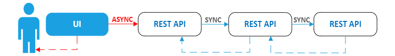

# Брокер сообщений
- [Что такое брокер сообщений?](#что-такое-брокер-сообщений)
- [Принципы работы очередей сообщений](#принципы-работы-очередей-сообщений)
- [Преимущества](#преимущества)
- [Sync vs Async: синхронное и асинхронное взаимодействие](#sync-vs-async-синхронное-и-асинхронное-взаимодействие)
- [Варианты использования очередей сообщений](#варианты-использования-очередей-сообщений)
- [Сложности использования и недостатки очередей сообщений: как с ними справляться](#сложности-использования-и-недостатки-очередей-сообщений-как-с-ними-справляться)
- [В каких случаях очереди неэффективны](#в-каких-случаях-очереди-неэффективны)
- [Источники](#источники)

## Что такое брокер сообщений?
> программное обеспечение и определённый архитектурный паттерн, который позволяет выстроить действия в информационных системах таким образом, чтобы обеспечить асинхронный обмен сообщениями между сервисами. Сервис, отправляющий данные, называется продюсер (producer), а потребляющий — потребитель (consumer).

Асинхронный обмен предполагает отправку запроса или сообщения от одного сервиса к другому, при этом деятельность сервиса-отправителя не приостанавливается в ожидании ответа от получателя.

Для обеспечения асинхронной доставки сообщений используется специальное программное обеспечение — брокер сообщений.

В настоящий момент брокеры часто используется в системах, предполагающих высокую нагрузку, доступность и производительность.

__Задачи брокера:__

- Получить сообщение от сервиса.
- Обеспечить маршрутизацию, управление очередями.
- Гарантировать доставку сообщения потребителю.

## Принципы работы очередей сообщений
Очереди предоставляют буфер для временного хранения сообщений и конечные точки, которые позволяют подключаться к очереди для отправки и получения сообщений в асинхронном режиме.

В сообщениях могут содержаться запросы, ответы, ошибки и иные данные, передаваемые между программными компонентами. Компонент, называемый производителем (Producer), добавляет сообщение в очередь, где оно будет храниться, пока другой компонент, называемый потребителем (Consumer), не извлечет сообщение и не выполнит с ним необходимую операцию.

Очереди поддерживают получение сообщений как методом Push, так и методом Pull:
- __метод Pull__ подразумевает периодический опрос очереди получателем по поводу наличия новых сообщений;
- __метод Push__ — отправку уведомления получателю в момент прихода сообщения. Второй метод реализует модель «Издатель/Подписчик» (Publisher/Subscriber).

Так как очереди могут использоваться несколькими производителями и потребителями одновременно, обычно их реализуют с помощью дополнительной системы, называемой брокером. Брокер сообщений (Message Broker) занимается сбором и маршрутизацией сообщений на основе предопределенной логики. Сообщения могут передаваться с некоторым ключом — по этому ключу брокер понимает, в какую из очередей (одну или несколько) должно попасть сообщение.

Вернемся к примеру с отправкой рецензии. Пусть та часть сервиса, к которому обращается пользователь, выступит в качестве производителя и будет направлять запросы на создание рецензий в очередь. Сразу после добавления сообщения в очередь пользователю можно направлять уведомление об успехе операции. Вся последующая логика обработки будет выполняться независимо от него на стороне потребителя, подписанного на очередь.

Завершив обработку, потребитель отправит подтверждение в очередь, после чего исходное сообщение будет удалено. Но если во время обработки произойдет сбой и подтверждение не будет получено вовремя, сообщение может быть повторно извлечено потребителем из очереди.

> Таким образом, использование очередей сообщений решает сразу две задачи: сокращает время ожидания пользователя за счет асинхронной обработки и предотвращает потерю информации при сбоях. Но не следует рассматривать очереди как универсальное средство для любого вида приложений: как и у любого инструмента, у них есть свои преимущества и недостатки, о которых мы поговорим ниже.

## Преимущества
1. __Надёжность__ — брокеры обеспечивают гарантированную доставку сообщений даже при сбоях в системах или их перегрузках. Также они учитывают порядок доставки и отслеживают её состояние.
2. __Масштабируемость__ — брокеры имеют гибкую архитектуру, что позволяет эффективно масштабировать систему горизонтально или вертикально при необходимости обработки больших объемов данных.
3. __Асинхронность__ — повышает производительность системы в целом, поскольку при асинхронном обмене сообщениями, различные компоненты системы работают независимо и обрабатывают их в своём темпе.
4. __Гибкость интеграции__ — брокеры можно назвать универсальным инструментом интеграции систем, так как они поддерживают различные протоколы и форматы сообщений.
5. __Безопасность__ - Большинство брокеров выполняют аутентификацию приложений, которые пытаются получить доступ к очереди, и позволяют использовать шифрование сообщений как при их передаче по сети, так и при хранении в самой очереди. Таким образом, очередь снимает с ваших сервисов бремя организации авторизации запросов.
6. __Балансировка нагрузки__ - Если один из сервисов не справляется с нагрузкой, требуется возможность запускать больше его экземпляров быстро и без дополнительных настроек. Обычно для этих целей используют балансировщик нагрузки, интегрированный с сервером обнаружения служб и предназначенный для распределения трафика. При использовании очередей сообщений сам брокер по умолчанию является балансировщиком нагрузки. Если несколько потребителей слушают очередь одновременно, сообщения будут распределяться между ними в соответствии с настроенной стратегией.
7. __Отделение логически независимых компонентов друг от друга (Decoupling)__ - Отличительная черта микросервисов — их автономность. И очереди во многом помогают уменьшить зависимости между ними. Каждое сообщение, передаваемое в очереди, — это всего лишь массив байтов с некоторыми метаданными. Метаданные нужны для направления в конкретную очередь, а информация, содержащаяся в основной части (теле) сообщения, может быть практически любой. Брокер не анализирует данные, он выступает лишь в качестве маршрутизатора. Это позволяет настроить взаимодействие между компонентами, работающими даже на разных языках и платформах.

## Sync vs Async: синхронное и асинхронное взаимодействие
Очереди сообщений (Message Queue) — это форма асинхронной коммуникации между сервисами. Поэтому, прежде чем говорить о них, покажем на упрощенном, немного искусственном примере разницу между синхронным и асинхронным взаимодействием.

Предположим, вы разрабатываете сайт книжного магазина и у вас есть сервис, к которому обращается пользователь, например отправка рецензии на прочитанную книгу. При нажатии кнопки «Отправить» вызывается некоторый API, который, в свою очередь, может обратиться к другим API.

При __синхронном взаимодействии__ все запросы в этой цепочке вызовов выполняются строго друг за другом, а при выполнении последнего запроса ответы последовательно передаются в обратном направлении. В итоге пользователь вынужден пару секунд ждать сообщения о публикации своего отзыва, хотя его не интересуют особенности серверной обработки и он вполне обоснованно хочет увидеть сообщение сразу после нажатия кнопки. Конечно, время ожидания будет во многом определяться мощностью оборудования, но при пиковых нагрузках оно может стать серьезной проблемой.

Еще один недостаток такой схемы — обработка сбоев. Если на одном из шагов возникнет исключение, оно каскадно возвратится назад, и пользователь получит уведомление об ошибке с просьбой повторно отправить рецензию. Вряд ли кого-то обрадует получение подобного сообщения после длительного ожидания.

Описанную схему можно изменить, добавив асинхронные вызовы. Достаточно вызвать в асинхронном режиме первый REST API и параллельно вернуть пользователю сообщение о том, что его рецензия принята и будет размещена, например, в течение суток. В итоге сайт не блокируется, а вызовы всех последующих API происходят независимо от пользователя.

Но у такой схемы также есть существенный недостаток: в случае сбоя в одном из API информация, введенная пользователем, будет потеряна. Если в первом примере в случае ошибок достаточно повторно отправить рецензию, то здесь ее необходимо заполнить заново.

Для устранения недостатков обеих схем как раз и предназначены очереди сообщений.

## Варианты использования очередей сообщений
Очереди сообщений полезны в тех случаях, где возможна асинхронная обработка. Рассмотрим наиболее частые сценарии использования очередей сообщений (Message Queue use Cases):
1. __Фоновая обработка долгосрочных задач на веб-сайтах__ - Сюда можно отнести задачи, которые не связаны напрямую с основным действием пользователя сайта и могут быть выполнены в фоновом режиме без необходимости ожидания с его стороны. Это обработка изображений, преобразование видео в различные форматы, создание отзывов, индексирование в поисковых системах после изменения данных, отправка электронной почты, формирование файлов и так далее.
2. __Буферизация при пакетной обработке данных__ - Очереди можно использовать в качестве буфера для некоторой массовой обработки, например пакетной вставки данных в БД или HDFS. Очевидно, что гораздо эффективнее добавлять сто записей за раз, чем по одной сто раз, так как сокращаются накладные расходы на инициализацию и завершение каждой операции. Но для стандартной архитектуры может стать проблемой генерация данных клиентской службой быстрее, чем их может обработать получатель. Очередь же предоставляет временное хранилище для пакетов с данными, где они будут храниться до завершения обработки принимающей стороной.
3. __Отложенные задачи__ - Многие системы очередей позволяют производителю указать, что доставка сообщений должна быть отложена. Это может быть полезно при реализации льготных периодов. Например, вы разрешаете покупателю отказаться от размещения заказа в течение определенного времени и ставите отложенное задание в очередь. Если покупатель отменит операцию в указанный срок, сообщение можно удалить из очереди.
4. __Сглаживание пиковых нагрузок__ - Помещая данные в очередь, вы можете быть уверены, что данные будут сохранены и в конечном итоге обработаны, даже если это займет немного больше времени, чем обычно, из-за большого скачка трафика. Увеличить скорость обработки в таких случаях также возможно — за счет масштабирования нужных обработчиков
5. __Гарантированная доставка при нестабильной инфраструктуре__ - Нестабильная сеть в сочетании с очередью сообщений создает надежный системный ландшафт: каждое сообщение будет отправлено, как только это будет технически возможно.
6. __Упорядочение транзакций__ - Многие брокеры поддерживают очереди FIFO, полезные в системах, где важно сохранить порядок транзакций. Если 1000 человек размещают заказ на вашем веб-сайте одновременно, это может создать некоторые проблемы с параллелизмом и не будет гарантировать, что первый заказ будет выполнен первым. С помощью очереди можно определить порядок их обработки.
7. __Сбор аналитической информации__ - Очереди часто применяют для сбора некоторой статистики, например использования определенной системы и ее функций. Как правило, моментальная обработка такой информации не требуется. Когда сообщения поступают в веб-службу, они помещаются в очередь, а затем при помощи дополнительных серверов приложений обрабатываются и отправляются в базу данных.
8. __Разбиение трудоемких задач на множество маленьких частей__ - Если у вас есть некоторая задача для группы серверов, то вам необходимо выполнить ее на каждом сервере. Например, при редактировании шаблона мониторинга потребуется обновить мониторы на каждом сервере, использующем этот шаблон. Вы можете поставить сообщение в очередь для каждого сервера и выполнять их одновременно в виде небольших операций.
9. __Прочие сценарии, требующие гарантированной доставки информации и высокого уровня отказоустойчивости__ - Это обработка финансовых транзакций, бронирование авиабилетов, обновление записей о пациентах в сфере здравоохранения и так далее.

## Сложности использования и недостатки очередей сообщений: как с ними справляться
Несмотря на многочисленные преимущества очередей сообщений, самостоятельное их внедрение может оказаться довольно сложной задачей по нескольким причинам:
1. По сути, это еще одна система, которую необходимо купить/установить, правильно сконфигурировать и поддерживать. Также потребуются дополнительные мощности.
2. Если брокер когда-либо выйдет из строя, это может остановить работу многих систем, взаимодействующих с ним. Как минимум необходимо позаботиться о резервном копировании данных.
3. С ростом числа очередей усложняется и отладка. При синхронной обработке сразу очевидно, какой запрос вызвал сбой, например, благодаря иерархии вызовов в IDE. В очередях потребуется позаботиться о системе трассировки, чтобы быстро связать несколько этапов обработки одного запроса для обнаружения причины ошибки.
4. При использовании очередей вы неизбежно столкнетесь с выбором стратегии доставки сообщений. В идеале сообщения должны обрабатываться каждым потребителем однократно. Но на практике это сложно реализовать из-за несовершенства сетей и прочей инфраструктуры. Большинство брокеров поддерживают две стратегии: доставка хотя бы раз (At-least-once) или максимум раз (At-most-once). Первая может привести к дубликатам, вторая — к потере сообщений. Обе требуют тщательного мониторинга. Некоторые брокеры также гарантируют строго однократную доставку (Exactly-once) с использованием порядковых номеров пакетов данных, но даже в этом случае требуется дополнительная проверка на стороне получателя.

Хорошая новость в том, что многие облачные провайдеры сейчас предлагают очереди как сервис (MQ as a Service). Поэтому если у вас недостаточно ресурсов для самостоятельной настройки и поддержки очередей сообщений, то можно воспользоваться одним из готовых решений. Большинство из них включает автоматизацию настройки, масштабирование, диагностику ошибок и техническую поддержку, а также поддерживает строго однократную доставку в очередях FIFO.

## В каких случаях очереди неэффективны
Конечно, очереди не являются универсальным средством для любых приложений. Рассмотрим варианты, когда очереди не будут самым эффективным решением:
- __У вашего приложения простая архитектура и функции, и вы не ожидаете его роста.__ Важно понимать, что очереди сообщений — это дополнительная сложность. Эту систему также необходимо настраивать, поддерживать, осуществлять мониторинг ее работы и так далее. Да, можно использовать Managed-решение, но вряд ли это будет оправдано для небольших приложений. Добавление очередей должно упрощать архитектуру, а не усложнять ее.
- __Вы используете монолитное программное обеспечение, в котором развязка (Decoupling) невозможна или не приоритетна.__ Если вы не планируете разбивать монолит на микросервисы, но вам требуется асинхронность — для ее реализации обычно достаточно стандартной многопоточной модели. Очереди могут оказаться избыточным решением до тех пор, пока не возникнет явная необходимость в разделении приложения на автономные компоненты, способные независимо выполнять задачи.

Выбирая инструмент для будущего приложения, обязательно взвесьте все за и против. Не стоит использовать очереди сообщений для задач, которые могут быть решены другим, более простым в настройке и обслуживании способом. Но в тех случаях, когда запланирован переход на микросервисы и бизнес-логика допускает возможность асинхронной обработки, очереди сообщений могут стать лучшим выбором для повышения производительности и надежности вашего продукта.

Если вы заинтересованы в использовании очередей, но опасаетесь, что команда не справится с их конфигурированием и последующей поддержкой самостоятельно, всегда можно воспользоваться одним из Managed-решений, представленных на рынке.

## Источники
- [Что такое RabbitMQ? Топология, объекты и атрибуты](#https://systems.education/what-is-rabbitmq)
- [Зачем нужны очереди сообщений в микросервисной архитектуре: разбираем преимущества и недостатки](https://cloud.vk.com/blog/zachem-nuzhny-ocheredi-soobshcheniy-v-mikroservisnoy-arkhitekture)