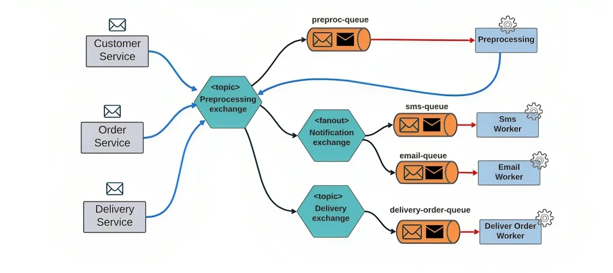

# RabbitMQ 
- [Что такое RabbitMQ и как он работает?](#что-такое-rabbitmq-и-как-он-работает)
- [Очереди (Queue)](#очереди-queue)
- [Точка обмена (Exchange)](#точка-обмена-exchange)
- [Сообщения (Message)](#сообщения-message)
- [Маршрутизация сообщений (Bindings)](#маршрутизация-сообщений-bindings)
- [Источники](#источники)

## Что такое RabbitMQ и как он работает?
RabbitMQ — это один из популярных брокеров, который служит посредником для обмена информацией между различными системами. Он осуществляет передачу сообщений посредством очередей.

RabbitMQ основан на протоколе AMQP (Advanced Message Queuing Protocol).
Разумеется, RabbitMQ — не единственный подобный инструмент. Также стоит упомянуть ActiveMQ, IBM MQ и LanvinMQ.

Например, LavinMQ, как и RMQ, работает на основе того же самого протокола AMQP, но его производительность на порядок выше. Продюсер может отправить около 1,6 млн сообщений в секунду, а потребитель может получить порядка 1,2 млн сообщений в секунду.

Чтобы обеспечить асинхронный обмен между продюсером и потребителем, RabbitMQ использует следующие компоненты:

3. Exchange — точка обмена;
4. Queue — очередь;
5. Message — сообщение.

Из этих трёх внутренних компонентов состоит вся топология объектов RabbitMQ, эти объекты могут многократно соединяться между собой, как показано на примере ниже.

Рассмотрим пример, когда несколько приложений публикуют сообщения, отправляя их в RMQ. Все входящие сообщения в этом примере попадают в точку обмена «Preprocessing exchange» — это единая точка в рассматриваемой топологии. Дальше брокер осуществляет их маршрутизацию и здесь возможны варианты:

Направить сообщение в какую-либо очередь;
Направить его в другие точки обмена, которые уже будут связаны с очередями.

В конечном счёте, каждая очередь подключается к консьюмеру, приложению Worker, которое читает эти сообщения и выполняет их дальнейшую обработку.
Среди прочих свойств, RabbitMQ часто приписывают свойство «проталкивать» сообщения потребителю. Для этого потребителю необходимо установить соединение, в рамках которого открывается канал взаимодействия и осуществляется транспортировка сообщений. Потребитель должен быть подписан на текущую очередь — это необходимое условие для доставки из неё.

## Очереди (Queue)
В RabbitMQ они работают по принципу FIFO (First Input First Output). При конфигурации очереди можно задавать как обязательные, так и необязательные параметры. Каждая очередь должна иметь уникальное имя и свойства, которые будут определять её поведение.

При формировании имён необходимо учитывать ограничения RabbitMQ:
- Длина имени не должна превышать 255 символов в кодировке utf-8.
- Имя не может начинаться со слова «amq.» — это зарезервированная часть для очередей создаваемых в RabbitMQ и используемых по умолчанию.

RabbitMQ можно установить параметр свойства __«Durable»__ (устойчивость) — это свойство определяет, сохранится ли очередь после перезапуска брокера. Для того, чтобы очередь была устойчива к сбоям брокера, этот параметр должен иметь значение «True» или, как указано в примере, «Durable».

    Cвойство «Устойчивость» не гарантирует, что сообщения в очереди, которые были опубликованы до сбоя, сохранятся после возобновления работы брокера. Это свойство гарантирует лишь сохранение самой очереди.

свойство __«Auto delete»__ (автоудаление). Оно означает, что как только последний потребитель заканчивает читать сообщения из очереди, она удаляется.

свойство __«Arguments»__ — аргументы очереди, это свойство не является обязательным, но оно позволяет задавать время сообщения и очередей по отдельности, а также задавать ограничения длины очереди, как в сообщениях так и в байтах и другие свойства, которые мы подробно рассмотрим в разделе формулирования требований.

## Точка обмена (Exchange)
> Все сообщения RabbitMQ, прежде чем попасть в очереди, публикуются в точке обмена брокера. Exchange принимает сообщения от приложения-производителя и направляет их в одну или несколько очередей на основе созданных связей между ним и очередью. 

__Типы точек обмена в AMQP:__
1. __Direct__ 
    - _Принцип работы:_ Прямая отправка сообщений в одну или несколько очередей с совпадающим значением ключа маршрутизации
    - _Сценарий применения:_ Когда есть точно известный ключ, по значению которого отдельные приложения-потребители должны получить подходящие сообщения
    
2. __Fanout__
    - _Принцип работы:_ Все сообщения отправляются во все очереди независимо от ключа маршрутизации
    - _Сценарий применения:_ Когда все приложения-потребители должны быстро получать все сообщения
    
3. __Headers__
    - _Принцип работы:_ Маршрутизация по нескольким атрибутам, заданным в заголовке сообщения. Ключ маршрутизации игнорируется
    - _Сценарий применения:_ Когда правила маршрутизации сообщения в очереди сложнее, чем просто по ключу, например, формат данных, комбинация полей и пр.
4. __Topic__
    - _Принцип работы:_ Сообщение отправляется в конкретные очереди по значению ключа маршрутизации, заданного по шаблону
    - _Сценарий применения:_ Когда ключ маршрутизации сложный и поток сообщений надо разделить по разным приложениям-потребителям
    

__Свойства Exchange:__
- __Name__, каждая точка обмена должна иметь уникальное название.
- __Durable__ — постоянная или «Transient» — временная очереди. Если есть необходимость создать постоянную точку обмена, которая будет храниться на диске даже после перезапуска сервера или брокера, то выбирается свойство «Durable». При выборе значения «Transient» точка обмена будет удаляться после перезагрузки.
- __Internal__ — внутренние точки обмена. Такой атрибут может принимать два значения: «да» или «нет». Если продюсеры не могут напрямую публиковать сообщения в эту точку обмена, то соответственно этот обменник имеет значение «нет». В том случае, если используем значение «да», то обменник используется исключительно в привязках с другими обменниками брокера.
- __AutoDelete__ — автоматическое удаление обменника. Этот атрибут удаляет точку обмена по завершению использования, после соответствующего удаления всех связанных с ней очередей.
- __Arguments__ — необязательные аргументы. Чаще всего через эти дополнительные аргументы задается альтернативная точка обмена. Она нужна в тех случаях, когда сообщение внутри брокера не может пройти по первоначальному маршруту, но с помощью данного аргумента его можно отправить в альтернативный обменник для маршрутизации по другому пути.

## Сообщения (Message)
> сущность, которая участвует в информационном обмене

__Структура:__
- Attributes — заголовок;
- Payload — блок полезной нагрузки;
- Headers — заголовки сообщения, блок дополнительных атрибутов, участвующих в построении логики обработки и маршрутизации в топологиях брокера

__Атрибуты:__
- Routing key — ключ маршрутизации, обязательная характеристика, которая позволяет обменнику типа Direct или Topic направить сообщение в очередь внутри брокера.
- Headers — содержит дополнительную информацию для сложной маршрутизации и используется обменником типа Headers. Иногда может быть нужно выполнить маршрутизацию в зависимости от одного какого-то ключа. Чаще можно столкнуться с необходимостью выполнить проверку нескольких условий. Эти условия можно указать как атрибуты в поле заголовка (Headers) и затем использовать их в брокере для более сложной маршрутизации.
- Properties — характеристики сообщений, наиболее важными из них являются тип (Content_type) и кодировка (Content_encoding).
- Delivery mode — режим доставки, сохранение опубликованных сообщений до момента их передачи потребителю.
    >Разновидности режима доставки:
    >- Persistent — постоянная, то есть сохранение сообщений;
    >- Non-persistent — непостоянная, несохранение сообщений.

    >Этот атрибут работает в связке с атрибутом Durable. Если Durable обеспечивает сохранность очереди, то Delivery mode отвечает за то, чтобы в случае сбоя или перезагрузки сервера ранее опубликованные в ней сообщения были сохранены.

## Маршрутизация сообщений (Bindings)
> Оно необходимо для установления привязки, которая обеспечивает взаимосвязь очереди и точки обмена. При необходимости точки обмена могут быть также соединены не только с очередью, но и между собой.

__Routing key__ -  Именно этот ключ должен совпадать с ключом, указанным в поле Bindings в настройках взаимодействия точек обмена и очереди.

## Источники
- [Что такое RabbitMQ? Топология, объекты и атрибуты](#https://systems.education/what-is-rabbitmq)