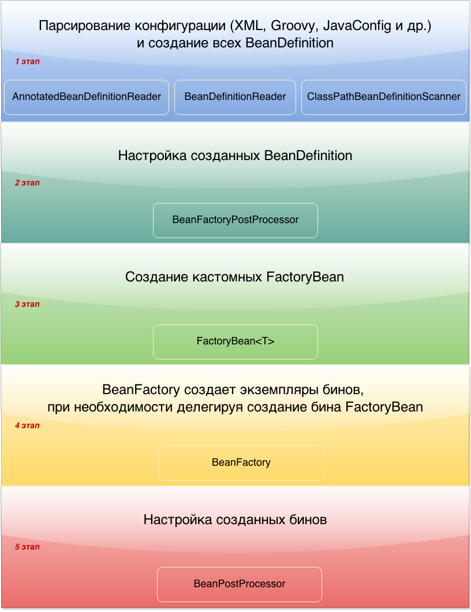

## Spring
- [@Transactional](transactional.md)
- [Spring Boot](spring-boot.md)
- [Что такое Spring?](#что-такое-spring)
- [Основные фраймворки внутри Spring](#основные-фраймворки-внутри-spring)
- [Особенности и преимущества Spring Framework?](#особенности-и-преимущества-spring-framework)
- [Spring контейнеры](#spring-контейнеры)
- [Жизненный цикл Context](#жизненный-цикл-context)
- [Как завершить работу контекста](#как-завершить-работу-контекста)
- [Bean](#bean)
- [Свойства Bean](#свойства-bean)
- [Жизненный цикл бинов](#жизненный-цикл-бинов)
- [Как настроить класс как Spring Bean?](#как-настроить-класс-как-spring-bean)
- [Статический Bean](#статический-bean)


## Что такое Spring?
Spring - фреймворк с открытым исходным кодом, предназначеный для упрощения разработки enterprise-приложений. Одним из главным преимуществом Spring является его слоистая архитектура, позволяющая вам самим определять какие компоненты будут использованы в вашем приложении. Модули Spring построены на базе основного контейнера, который определяет создание, конфигурация и менеджмент бинов.


## Основные фраймворки внутри Spring
__Основной контейнер (Beans, Core, Context, SpEL)__ - предоставляет основной функционал Spring, управляющий процессом создания и настройки компонентов приложения. 
- __Beans__ отвечает за BeanFactory которая является сложной реализацией паттерна Фабрика (GoF).  
- __Core__ обеспечивает ключевые части фреймворка, включая свойства IoC и DI. 
- __Context__ построен на основе Beans и Core и позволяет получить доступ к любому объекту, который определён в настройках. Ключевым элементом модуля Context является интерфейс ApplicationContext. 
- __SpEL__ обеспечивает мощный язык выражений для манипулирования объектами во время исполнения. В нем есть тернатрные, арефметические, логические операторы. Может получить доступ к элементам коллекций.

__Spring AOP (AOP, Aspects)__ - отвечает за интеграцию аспектно-ориентированного программирования во фреймворк. Spring AOP обеспечивает сервис управления транзакциями для Spring-приложения.

__Spring Data__ — дополнительный удобный механизм для взаимодействия с сущностями базы данных, организации их в репозитории, извлечение данных, изменение, в каких то случаях для этого будет достаточно объявить интерфейс и метод в нем, без имплементации. Например с использованием JPA. Состоит из JDBC, ORM, OXM, JMS и модуля Transactions. 
- __JDBC__ обеспечивает абстрактный слой JDBC и избавляет разработчика от необходимости вручную прописывать монотонный код, связанный с соединением с БД. 
- __ORM__ обеспечивает интеграцию с такими популярными ORM, как Hibernate, JDO, JPA и т.д. 
- __OXM__ отвечает за связь Объект/XML – XMLBeans, JAXB и т.д. 
- __JMS__ (Java Messaging Service) отвечает за создание, передачу и получение сообщений. 
- __Transactions__ поддерживает управление транзакциями для классов, которые реализуют определённые методы.

__Spring Web module (Web, Servlet, Portlet, Struts)__ - Модуль Web обеспечивает такие функции, как загрузка файлов и т.д. 
- __Web-MVC__ содержит реализацию Spring MVC для веб-приложений. 
- __Web-Socket__ обеспечивает поддержку связи между клиентом и сервером, используя Web-Socket-ы в веб-приложениях. 
- __Web-Portlet__ обеспечивает реализацию MVC в среде портлетов.

__Spring MVC framework__ - реализация паттерна MVC для построения Web-приложений.

__Spring Integration__ - обеспечивает легкий обмен сообщениями в приложениях на базе Spring и поддерживает интеграцию с внешними системами через декларативные адаптеры. Эти адаптеры обеспечивают более высокий уровень абстракции по сравнению с поддержкой Spring для удаленного взаимодействия, обмена сообщениями и планирования. Основная цель Spring Integration - предоставить простую модель для построения корпоративных решений по интеграции, сохраняя при этом разделение задач, что важно для создания поддерживаемого, тестируемого кода.

__Spring Cloud__ - инструменты для создания сложных топологий для потоковой и пакетной передачи данных.

__Spring Batch__ - предоставляет многократно используемые функции, которые необходимы для обработки больших объемов записей, включая ведение журнала / трассировку, управление транзакциями, статистику обработки заданий, перезапуск заданий, пропуск и управление ресурсами. Он также предоставляет более продвинутые технические услуги и функции, которые позволят выполнять пакетные задания чрезвычайно большого объема и с высокой производительностью благодаря методам оптимизации и разделения. Простые и сложные пакетные задания большого объема могут использовать платформу с высокой степенью масштабируемости для обработки значительных объемов информации.

__Spring Kafka__ - Проект Spring for Apache Kafka (spring-kafka) применяет основные концепции Spring для разработки решений для обмена сообщениями на основе Kafka. Он предоставляет «шаблон» в качестве высокоуровневой абстракции для отправки сообщений. Он также обеспечивает поддержку управляемых сообщениями POJO с @KafkaListener аннотациями и «контейнером слушателя». Эти библиотеки способствуют использованию инъекций зависимостей и декларативных. Во всех этих случаях вы увидите сходство с поддержкой JMS в Spring Framework и поддержкой RabbitMQ в Spring AMQP.

__Spring Security__ - Фреймворк аутентификации и авторизации: конфигурируемый инструментарий процессов аутентификации и авторизации, поддерживающий много популярных и ставших индустриальными стандартами протоколов, инструментов, практик.

__Тестирование__ - каркас, поддерживающий классы для написания модульных и интеграционных тестов.

## Особенности и преимущества Spring Framework?
Spring Framework обеспечивает решения многих задач, с которыми сталкиваются Java-разработчики и организации, которые хотят создать информационную систему, основанную на платформе Java. Из-за широкой функциональности трудно определить наиболее значимые структурные элементы, из которых он состоит. Spring Framework не всецело связан с платформой Java Enterprise, несмотря на его масштабную интеграцию с ней, что является важной причиной его популярности.

Spring Framework, вероятно, наиболее известен как источник расширений (features), нужных для эффективной разработки сложных бизнес-приложений вне тяжеловесных программных моделей, которые исторически были доминирующими в промышленности. Ещё одно его достоинство в том, что он ввел ранее неиспользуемые функциональные возможности в сегодняшние господствующие методы разработки, даже вне платформы Java. Этот фреймворк предлагает последовательную модель и делает её применимой к большинству типов приложений, которые уже созданы на основе платформы Java. Считается, что Spring Framework реализует модель разработки, основанную на лучших стандартах индустрии, и делает её доступной во многих областях Java.

Таким образом к достоинствам Spring можно отнести:
+ Относительная легкость в изучении и применении фреймворка в разработке и поддержке приложения.
+ Внедрение зависимостей (DI) и инверсия управления (IoC) позволяют писать независимые друг от друга компоненты, что дает преимущества в командной разработке, переносимости модулей и т.д..
+ Spring IoC контейнер управляет жизненным циклом Spring Bean и настраивается наподобие JNDI lookup (поиска).
+ Проект Spring содержит в себе множество подпроектов, которые затрагивают важные части создания софта, такие как вебсервисы, веб программирование, работа с базами данных, загрузка файлов, обработка ошибок и многое другое. Всё это настраивается в едином формате и упрощает поддержку приложения.


## Spring контейнеры
__Container__ создаёт объекты, связывает их вместе, настраивает и управляет ими от создания до момента уничтожения. Spring Container получает инструкции какие объекты инстанциировать и как их конфигурировать через метаданные: 
- __XML__ 
- __Аннотации__
- __Java код__

__Spring BeanFactory Container__ Это самый простой контейнер, который обеспечивает базовую поддержку DI и который основан на интерфейсе org.springframework.beans.factory.BeanFactory. Такие интерфейсы, как BeanFactoryAware и DisposableBean всё ещё присутствуют в Spring для обеспечения обратной совместимости.

Бины создаются при вызове метода getBean().

Наиболее часто используемая реализация интерфейса BeanFactory – XmlBeanFactory. XmlBeanFactory получает метаданные из конфигурационного XML файла и использует его для создания настроенного приложения или системы. BeanFactory обычно используется тогда, когда ресурсы ограничены (мобильные устройства). Поэтому, если ресурсы не сильно ограничены, то лучше использовать ApplicationContext.

__Spring ApplicationContext Container__  ApplicationContext является более сложным и более продвинутым Spring Container-ом. Наследует BeanFactory и так же загружает бины, связывает их вместе и конфигурирует их определённым образом. Но кроме этого, ApplicationContext обладает дополнительной функциональностью: общий механизм работы с ресурсами, распознание текстовых сообщений из файлов настройки и отображение событий, которые происходят в приложении различными способами. Этот контейнер определяется интерфейсом org.springframework.context.ApplicationContext.

Бины создаются при "поднятии" контекста все сразу. Если не указана стратегия инициализации.

Чаще всего используются следующие реализации AppicationContext:
+ FileSystemXmlApplicationContext - Загружает данные о бине из XML файла. При использовании этой реализации в конструкторе необходимо указать полный адрес конфигурационного файла.

+ ClassPathXmlApplicationContext - Этот контейнер также получает данные о бине из XML файла. Но в отличие от FileSystemApplicationContext, в этом случае необходимо указать относительный адрес конфигурационного файла (CLASSPATH).

+ AnnotationConfigApplicationContext — метаданные конфигурируются с помощью аннотаций прямо на классах.

+ WebApplicationContext — для веб-приложений

+ GenericGroovyApplicationContext - эта конфигурация работает по сути так же, как и Xml, только с Groovy-файлами. К тому же, GroovyApplicationContext нормально работает и с Xml-файлом. Принимает на вход строку с конфигурацией контекста. Чтением контекста в данном случае занимается класс GroovyBeanDefinitionReader.

При этом мы можем указать несколько файлов конфигурации Spring.

Отличия ApplicationContext и BeanFactory
1. ApplicationContext загружает все бины при запуске, а BeanFactory - по требованию.
2. ApplicationContext расширяет BeanFactory и предоставляет функции, которые подходят для корпоративных приложений:
    1. поддержка внедрения зависимостей на основе аннотаций;
    2. удобный доступ к MessageSource (для использования в интернационализации);
    3. публикация ApplicationEvent - для бинов, реализующих интерфейс ApplicationListener, с помощью интерфейса ApplicationEventPublisher;
    4. простая интеграция с функциями Spring AOP.
3. ApplicationContext поддерживает автоматическую регистрацию BeanPostProcessor и BeanFactoryPostProcessor. Поэтому всегда желательно использовать ApplicationContext, потому что Spring 2.0 (и выше) интенсивно использует BeanPostProcessor.
4. ApplicationContext поддерживает практически все типы scope для бинов, а BeanFactory поддерживает только два - Singleton и Prototype.
5. В BeanFactory не будут работать транзакции и Spring AOP. Это может привести к путанице, потому что конфигурация с виду будет корректной


## Жизненный цикл Context
+ Контейнер создается при запуске приложения
+ Контейнер считывает конфигурационные данные (парсинг XML, JavaConfig)
+ Из конфигурационных данных создается описание бинов (BeanDafinition) BeanDefenitionReader
+ BeanFactoryPostProcessors обрабатывают описание бина
+ Контейнер создает бины используя их описание
+ Бины инициализируются — значения свойств и зависимости внедряются в бин (настраиваются)
+ BeanPostProcessor запускают методы обратного вызова(callback methods)
+ Приложение запущено и работает
+ Инициализируется закрытие приложения
+ Контейнер закрывается
+ Вызываются callback methods



https://habr.com/ru/post/222579/


## Как завершить работу контекста
Если это не веб-приложение, то есть 2 способа:

+ Регистрация shutdown-hook с помощью вызова метода registerShutdownHook(), он также реализован в классе AbstractApplicationContext. Это предпочтительный способ.
+ Можно вызвать метод close() из класса AbstractApplicationContext.

В Spring Boot приложении: Spring Boot самостоятельно зарегистрирует shutdown-hook за вас.


## Bean
__Бин (bean)__ — это не что иное, как самый обычный объект. Разница лишь в том, что бинами принято называть те объекты, которые управляются Spring-ом и живут внутри его DI-контейнера.

По умолчанию бин задается как синглтон в Spring. Таким образом все публичные переменные класса могут быть изменены одновременно из разных мест, а значит бин - не потокобезопасен. Однако поменяв область действия бина на request, prototype, session он станет потокобезопасным, но это скажется на производительности.

Конфигурационный файл спринг определяет все бины, которые будут инициализированы в Spring Context. При создании экземпляра Spring ApplicationContext будет прочитан конфигурационный xml файл и выполнены указанные в нем необходимые инициализации. Отдельно от базовой конфигурации, в файле могут содержаться описание перехватчиков (interceptors), view resolvers, настройки локализации и др.

Определение бина содержит метаданные конфигурации, которые необходимы управляющему контейнеру для получения следующей информации: 
- Как создать бин; 
- Информацию о жизненном цикле бина; 
- Зависимости бина.

## Свойства Bean
__class__ - Этот атрибут является обязательным и указывает конкретный класс Java-приложения, который будет использоваться для создания бина.

__name__ - Уникальный идентификатор бина. В случае конфигурации с помощью xml-файла, вы можете использовать свойство “id” и/или “name” для идентификации бина. Атрибут name также может принимать массив String, что позволяет использовать несколько имен. Первый элемент массива будет являться именем и уникальным идентификатором бина, а остальные будут его псевдонимами.

__scope__ - Это свойство определяет область видимости создаваемых объектов:
- __singleton__ - Определяет один единственный бин для каждого контейнера Spring IoC (используется по умолчанию);
- __prototype__ - контейнер Spring IoC создаёт новый экземпляр бина на каждый полученный запрос т.е. иметь любое количество экземпляров бина;
- __request__ - Создаётся один экземпляр бина на каждый HTTP запрос. Касается исключительно ApplicationContext;
- __session__ - Создаётся один экземпляр бина на каждую HTTP сессию. Касается исключительно ApplicationContext;
- __web soccet__ - Создаётся один экземпляр бина для определенного сокета.
- __application__ - Создаётся один экземпляр бина для жизненного цикла бина. Похоже на синглтон, но когда бобы ограничены областью приложения, значения, однажды установленное в applicationScopedBean, будет сохранено для всех последующих запросов, сеансов и даже для другого приложения сервлета, которое будет обращаться к этому Бобу, при условии, что оно выполняется в том же ServletContext. В то время как одноэлементные бобы ограничены только одним контекстом приложения.

__constructor-arg__ - Определяет конструктор, использующийся для внедрения зависимости. 

__properties__ - Определяет свойства внедрения зависимости. 

__initialization method__ - Здесь определяется метод инициализации бина

__destruction method__ - Метод уничтожения бина, который будет использоваться при уничтожении контейнера, содержащего бин.

__autowiring mode__ - Определяет режим автоматического связывания при внедрении зависимости.

__lazy-initialization mode__ - Режим ленивой инициализации даёт контейнеру IoC команду создавать экземпляр бина при первом запросе, а не при запуске приложения.

Классы, аннотированные @Configuration, проксируются через CGLIB. Классы @Component или обычные классы не проксируются и не перехватывают вызовы методов с аннотациями @Bean, что означает, что вызовы не будут маршрутизироваться через контейнер и каждый раз будет возвращаться новый экземпляр бина.

## Жизненный цикл бинов
### Кратко
+ Загрузка описаний бинов, создание графа зависимостей(между бинами)
+ Создание и запуск BeanFactoryPostProcessors
+ Создание бинов
+ Spring внедряет значения и зависимости в свойства бина
+ Если бин реализует метод setBeanName() из интерфейса NameBeanAware, то ID бина передается в метод
+ Если бин реализует BeanFactoryAware, то Spring устанавливает ссылку на bean factory через setBeanFactory() из этого интерфейса.
+ Если бин реализует интерфейс ApplicationContextAware, то Spring устанавливает ссылку на ApplicationContext через setApplicationContext().
+ BeanPostProcessor это специальный интерфейс, и Spring позволяет бинам имплементировать этот интерфейс. Реализуя метод postProcessBeforeInitialization(), можно изменить экземпляр бина перед его(бина) инициализацией(установка свойств и т.п.)
+ Если определены методы обратного вызова, то Spring вызывает их. Например, это метод, аннотированный @PostConstruct или метод initMethod из аннотации @Bean.
+ Теперь бин готов к использованию. Его можно получить с помощью метода ApplicationContext#getBean().
+ После того как контекст будет закрыт (метод close() из ApplicationContext), бин уничтожается.
+ Если в бине есть метод, аннотированный @PreDestroy, то перед уничтожением вызовется этот метод. Если бин имплементирует DisposibleBean, то Spring вызовет метод destroy(), чтобы очистить ресурсы или убить процессы в приложении. Если в аннотации @Bean определен метод destroyMethod, то вызовется и он.

Интерфейс BeanPostProcessor позволяют разработчику самому имплементировать некоторые методы бинов перед инициализацией и после уничтожения экземпляров бина.
Имеется возможность настраивать несколько имлементаций BeanPostProcessor и определить порядок их выполнения. Данный интерфейс работает с экземплярами бинов, а это означает, что Spring IoC создаёт экземпляр бина, а затем BeanPostProcessor с ним работает. ApplicationContext автоматически обнаруживает любые бины, с реализацией BeanPostProcessor и помечает их как “post-processors” для того, чтобы создать их определённым способом.

Интерфейс BeanPostProcessor имеет всего два метода: postProcessBeforeInitialization и postProcessAfterInitialization

### Подробно

#### 1. Парсирование конфигурации и создание BeanDefinition

Цель первого этапа — это создание всех BeanDefinition. 

Объекты BeanDefinition — это набор метаданных будущего бина, макет, по которому нужно будет создавать бин в случае необходимости. То есть для каждого бина создается свой объект BeanDefinition, в котором хранится описание того, как создавать и управлять этим конкретным бином. Проще говоря, сколько бинов в программе - столько и объектов BeanDefinition, их описывающих.

BeanDefinition содержат (среди прочего) следующие метаданные:
- Имя класса с указанием пакета: обычно это фактический класс бина.
- Элементы поведенческой конфигурации бина, которые определяют, как бин должен вести себя в контейнере (scope, обратные вызовы жизненного цикла и т.д.).
- Ссылки на другие bean-компоненты, которые необходимы для его работы. Эти ссылки также называются зависимостями.
- Другие параметры конфигурации для установки во вновь созданном объекте - например, ограничение размера пула или количество соединений, используемых в бине, который управляет пулом соединений.

Эти метаданные преобразуются в набор свойств, которые составляют каждое BeanDefinition.

При конфигурации через аннотации с указанием пакета для сканирования или JavaConfig используется класс AnnotationConfigApplicationContext. Регистрируются все классы с @Configuration для дальнейшего парсирования, затем регистрируется специальный BeanFactoryPostProcessor, а именно BeanDefinitionRegistryPostProcessor, который при помощи класса ConfigurationClassParser парсирует JavaConfig, загружает описания бинов (BeanDefinition), создаёт граф зависимостей (между бинами) и создаёт:
```java
Map<String, BeanDefinition> beanDefinitionMap = new ConcurrentHashMap<>(256);
```
в которой хранятся все описания бинов, обнаруженных в ходе парсинга конфигурации.

#### 2. Настройка созданных BeanDefinition

После первого этапа у нас имеется коллекция Map, в которой хранятся BeanDefinition-ы. BeanFactoryPostProcessor-ы на этапе создания BeanDefinition-ов могут их настроить как нам необходимо. BeanFactoryPostProcessor-ы могут даже настроить саму BeanFactory ещё до того, как она начнет работу по созданию бинов. В интерфейсе BeanFactoryPostProcessor всего один метод:
```java
public interface BeanFactoryPostProcessor {
    void postProcessBeanFactory(ConfigurableListableBeanFactory beanFactory) throws BeansException;
}
```

#### 3. Создание кастомных FactoryBean (только для XML-конфигурации)

#### 4. Создание экземпляров бинов

Сначала BeanFactory из коллекции Map с объектами BeanDefinition достаёт те из них, из которых создаёт все BeanPostProcessor-ы, необходимые для настройки обычных бинов. Создаются экземпляры бинов через BeanFactory на основе ранее созданных BeanDefinition

#### 5. Настройка созданных бинов

На данном этапе бины уже созданы, мы можем лишь их донастроить.

Интерфейс BeanPostProcessor позволяет вклиниться в процесс настройки наших бинов до того, как они попадут в контейнер. ApplicationContext автоматически обнаруживает любые бины с реализацией BeanPostProcessor и помечает их как “post-processors” для того, чтобы создать их определенным способом. Например, в Spring есть реализации BeanPostProcessor-ов, которые обрабатывают аннотации @Autowired, @Inject, @Value и @Resource.

Интерфейс несет в себе два метода: postProcessBeforeInitialization(Object bean, String beanName) и postProcessAfterInitialization(Object bean, String beanName). У обоих методов параметры абсолютно одинаковые. Разница только в порядке их вызова. Первый вызывается до init-метода, второй - после.

Как правило, BeanPostProcessor-ы, которые заполняют бины через маркерные интерфейсы или тому подобное, реализовывают метод postProcessBeforeInitialization (Object bean, String beanName), тогда как BeanPostProcessor-ы, которые оборачивают бины в прокси, обычно реализуют postProcessAfterInitialization (Object bean, String beanName).

Прокси — это класс-декорация над бином. Например, мы хотим добавить логику нашему бину, но джава-код уже скомпилирован, поэтому нам нужно на лету сгенерировать новый класс. Этим классом мы должны заменить оригинальный класс так, чтобы никто не заметил подмены.

Есть два варианта создания этого класса:
- либо он должен наследоваться от оригинального класса (CGLIB) и переопределять его методы, добавляя нужную логику;
- либо он должен имплементировать те же самые интерфейсы, что и первый класс (Dynamic Proxy).

>По конвенции спринга, если какой-то из BeanPostProcessor-ов меняет что-то в классе, то он должен это делать на этапе postProcessAfterInitialization(). Таким образом мы уверены, что initMethod у данного бина, работает на оригинальный метод, до того, как на него накрутился прокси.

Хронология событий:
1. Сначала сработает метод postProcessBeforeInitialization() всех имеющихся BeanPostProcessor-ов.
2. Затем, при наличии, будет вызван метод, аннотированный @PostConstruct.
3. Если бин имплементирует InitializingBean, то Spring вызовет метод afterPropertiesSet() - не рекомендуется к использованию как устаревший.
4. При наличии, будет вызван метод, указанный в параметре initMethod аннотации @Bean.
5. В конце бины пройдут через postProcessAfterInitialization(Object bean, String beanName). Именно на данном этапе создаются прокси стандартными BeanPostProcessor-ами. Затем отработают наши кастомные BeanPostProcessor-ы и применят нашу логику к прокси-объектам. После чего все бины окажутся в контейнере, который будет обязательно обновлен методом refresh().
6. Но даже после этого мы можем донастроить наши бины ApplicationListener-ами.
7. Теперь всё


#### 6. Бины готовы к использованию

Их можно получить с помощью метода ApplicationContext#getBean().

#### 7. Закрытие контекста

Когда контекст закрывается (метод close() из ApplicationContext), бин уничтожается.

Если в бине есть метод, аннотированный @PreDestroy, то перед уничтожением вызовется этот метод.

Если бин имплементирует DisposibleBean, то Spring вызовет метод destroy() - не рекомендуется к использованию как устаревший.

Если в аннотации @Bean определен метод destroyMethod, то будет вызван и он.


__@PostConstruct__

Spring вызывает методы, аннотированные @PostConstruct, только один раз, сразу после инициализации свойств компонента. За данную аннотацию отвечает один из BeanPostProcessor-ов.

Метод, аннотированный @PostConstruct, может иметь любой уровень доступа, может иметь любой тип возвращаемого значения (хотя тип возвращаемого значения игнорируется Spring-ом), метод не должен принимать аргументы. Он также может быть статическим, но преимуществ такого использования метода нет, т.к. доступ у него будет только к статическим полям/методам бина, и в таком случае смысл его использования для настройки бина пропадает.

Одним из примеров использования @PostConstruct является заполнение базы данных. Например, во время разработки нам может потребоваться создать пользователей по умолчанию.

__@PreDestroy__

Метод, аннотированный @PreDestroy, запускается только один раз, непосредственно перед тем, как Spring удаляет наш компонент из контекста приложения.

Как и в случае с @PostConstruct, методы, аннотированные @PreDestroy, могут иметь любой уровень доступа, но не могут быть статическими.

Целью этого метода может быть освобождение ресурсов или выполнение любых других задач очистки до уничтожения бина, например, закрытие соединения с базой данных.

Обратите внимание, что аннотации @PostConstruct и @PreDestroy являются частью Java EE, а именно пакета javax.annotation модуля java.xml.ws.annotation. И поскольку Java EE устарела в Java 9, то с этой версии пакет считается устаревшим (Deprecated). С Java 11 данный пакет вообще удален, поэтому мы должны добавить дополнительную зависимость для использования этих аннотаций:
```xml
<dependency>
    <groupId>javax.annotation</groupId>
    <artifactId>javax.annotation-api</artifactId>
    <version>1.3.2</version>
</dependency>
```

## Как настроить класс как Spring Bean?
1) __XML конфигурация__
```xml
<bean name="myBean" class="project.spring.beans.MyBean"></bean>
```

2) __Java code__ - все настройки прописываются непосредственно в коде
```java
@Configuration
@ComponentScan(value="project.spring.main")
public class MyConfiguration [

    @Bean
    public MyService getService() {
        return new MyService();
    }
}
```
Для извлечения бина:
```java
AnnotationConfigApplicationContext ctx = new AnnotationConfigApplicationContext(MyConfiguration.class);
MyService service = ctx.getBean(MyService.class);
```
3) __Annotation__ - внутри кода используются аннотации @Component, @Service, @Repository, @Controller для указания классов как бины. Для их поиска и управления контейнером прописывается настройка в xml файле
```java
<context:component-scan base-package="project.spring"/>
```


## Статический Bean
Если в классе будет статический метод, то при инициализации впервую очередь создастся статический метод (из-за особенностей статических полей), а потом уже Bean, который "навешивается" на статический метод.

При этом Spring не позволяет внедрять бины напрямую в статические поля, нужно создать нестатический сеттер-метод
```java
@Component
public class TestDataInit {
    @Autowired
    private static OrderItemService orderItemService; //будет null
}


@Component
public class TestDataInit {
    private static OrderItemService orderItemService;

    @Autowired
    public void setOrderItemService(OrderItemService orderItemService) {
        TestDataInit.orderItemService = orderItemService;
    }
}
